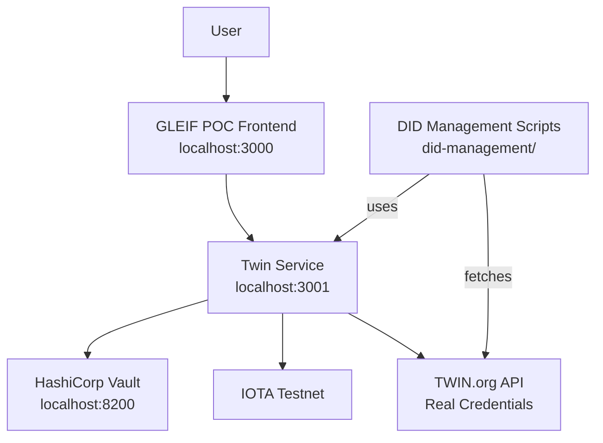

# GLEIF POC — vLEI ↔ TWIN ID Linkage Verifier

...

## 🎯 Clarifying Our Approach: DID Linking vs. Domain Linkage

It's important to be precise about the verification methods this PoC implements.

* **W3C Domain Linkage:** This method involves an entity proving control over their own web domain (`my-company.com`) by hosting a credential there. It's a self-sovereign, highly technical approach.

* **DID Linking (Issuer-Based Method):** This method uses a trusted third party (in our case, a simulated Qualified vLEI Issuer or QVI) to issue a credential that links the vLEI's `did:webs` to the TWIN ID's `did:iota`. The trust is anchored in the authority of the QVI.

**This PoC demonstrates both DID Linking and W3C Domain Linkage.** The DID Linking approach is highly scalable as it relies on a network of trusted issuers rather than requiring every business to manage its own public web infrastructure. The Domain Linkage flow lets the legal entity self-host a DID Configuration file on its own domain (simulated here by the Next.js app).

---

## Proof of Concept for Decentralized Legal Entity Verification

This project is a working prototype that links GLEIF vLEI (verifiable Legal Entity Identifier) credentials to TWIN IDs on the IOTA testnet. It enables trustless, transparent verification of legal entity identities using blockchain technology.

**🎯 Key Features Demonstrated:**

* ✅ **DID Linking Verification:** Demonstrates the issuer-based linkage between a vLEI `did:webs` and a TWIN `did:iota`.
* ✅ **Domain Linkage Verification:** Hosts a DID Configuration file and verifies the signed Domain Linkage credential served from the simulated company website.
* ✅ **Bi-directional Verification:** Confirms the link between traditional LEIs and decentralized DIDs.
* ✅ **Live Blockchain Operations:** Uses the real IOTA testnet for DID management and NFT-based attestations.
* ✅ **Secure Key Management:** Integrates with HashiCorp Vault for secure wallet operations.
* ✅ **Blockchain Transparency:** Provides direct links to the IOTA Explorer for a public audit trail.

**⚠️ Current Scope:** This is a proof of concept to demonstrate technical feasibility. A production-ready system would require integration with a GLEIF-accredited Qualified vLEI Issuer (QVI).

---

## 🏗️ Architecture

The POC consists of a frontend UI, a backend service for identity operations, and integrations with Vault (using Transit Engine for secure key operations) and the IOTA testnet.



---

## 🚀 Getting Started

> **Note:** All setup commands should be run from the project root directory.

### 🛠️ Prerequisites

* Node.js v18+
* npm
* Docker
* `jq`
* Git

### 📂 Project Structure

* `gleif-frontend/`: The Next.js UI, including the verification API route.
* `twin-service/`: Express backend for managing DIDs and NFTs.
* `did-management/`: Scripts for identity creation and credential generation.
  * `create-domain-linkage.js`: Requests a Domain Linkage credential and writes the DID Configuration file for the simulated domain.
* `test-e2e.sh`: End-to-end testing script.

### ⚡ Quickstart

You can run the project with or without HashiCorp Vault.

#### With Vault (Recommended)

1. **Start Vault and enable Transit Engine:**

    ```bash
      docker run -d --name vault-dev -p 8200:8200 -e VAULT_DEV_ROOT_TOKEN_ID=root hashicorp/vault server -dev
      sleep 5
      docker exec -e VAULT_ADDR=http://127.0.0.1:8200 vault-dev vault login root
      docker exec -e VAULT_ADDR=http://127.0.0.1:8200 vault-dev vault secrets enable transit
      docker exec -e VAULT_ADDR=http://127.0.0.1:8200 vault-dev vault write -f transit/keys/wallet-key
    ```

2. **Start the Backend:**

    ```bash
    cd twin-service && cp .env.vault .env && npm run start:vault
    ```

3. **Generate Credentials:**

    ```bash
    cd did-management && node manage-did.js && ./generate-credentials.sh $(jq -r '.did' twin-wallet.json)
    ```

    > This script now generates both the simulated QVI credential (DID Linking path) and the DID Configuration file containing the signed Domain Linkage credential. It also publishes the `LinkedDomains` service on the freshly created DID document so the frontend can host the domain proof.

4. **Start the Frontend:**

    ```bash
    cd gleif-frontend && npm run dev
    ```

> 👉 Services will be available at: **Frontend**: `http://localhost:3000`, **Backend**: `http://localhost:3001`, **Vault**: `http://localhost:8200` (with Transit Engine enabled).

#### Without Vault

1. **Start the Backend:**

    ```bash
    cd twin-service && npm run dev
    ```

2. **Start the Frontend:**

    ```bash
    cd gleif-frontend && npm run dev
    ```

### Next Steps

After setup, the `generate-credentials.sh` script creates simulated credentials including a QVI-issued DID Linking credential and a Domain Linkage credential hosted in the DID Configuration file. These credentials link the vLEI `did:webs` to the TWIN `did:iota`, and the script publishes the `LinkedDomains` service on the DID document for frontend hosting.

To access and test the frontend, navigate to `http://localhost:3000` in your browser. Enter a TWIN DID (e.g., from `twin-wallet.json`) to verify the linkage and generate an attestation NFT on the IOTA testnet.

For detailed testing instructions, refer to [`MANUAL_TESTING_GUIDE.md`](MANUAL_TESTING_GUIDE.md).

---

## ⚙️ How the POC Works

This POC demonstrates a complete, end-to-end flow for decentralized identity verification.

### Verification Flow

1. **Identity Resolution:** Resolves TWIN IDs directly from the IOTA Distributed Ledger.
2. **Credential Verification:** Checks the linkage between the resolved TWIN ID and a vLEI credential stored in a local registry.
3. **Blockchain Attestation:** Creates an immutable attestation on the IOTA testnet, consisting of:
      * **Attestation DID:** A permanent DID document containing the verified identity information.
      * **Verification NFT:** An NFT with immutable metadata storing the DID document for easy sharing and verification.
4. **Explorer Integration:** Provides direct links to the IOTA Explorer to view the on-chain attestation and NFT.

### What Gets Stored on the Blockchain

| Component         | Content                                                              | Purpose                                                  |
| ----------------- | -------------------------------------------------------------------- | -------------------------------------------------------- |
| **Attestation DID** | Complete IOTA DID document (keys, endpoints, revocation info).     | An immutable, resolvable record of the verified identity.  |
| **NFT Metadata** | The DID document (as a JSON string) and verification details (vLEI, timestamp). | A user-friendly, shareable proof of the verification.      |

This process proves that a specific IOTA DID, controlled by a valid wallet, was verified to be linked to a GLEIF vLEI at a specific time.

---

## 🎯 Business Value & Vision

### Key Benefits

* **Decentralized Trust:** Verification does not require a central intermediary.
* **Blockchain Immutability:** Creates a permanent, tamper-proof audit trail.
* **Interoperability:** Bridges traditional financial identity systems (LEI) with Web3 ecosystems (DID/NFT).
* **Cost-Effective:** Reduces the complexity and cost of identity verification.

### Implementation Models

* **Self-Hosted:** Organizations manage their own vLEI event logs and credentials on their web servers. This offers maximum control with zero infrastructure cost but requires technical expertise.
* **QVI as a Service:** A Qualified vLEI Issuer (QVI) handles all credential management, providing an additional layer of trust and simplifying adoption for non-technical organizations.

---

## 🔮 From POC to Production

### 🚨 Critical Missing Component: QVI Accreditation

The most critical step toward a production system is validating that the vLEI credential issuer is a **GLEIF-accredited QVI**.

| Feature                 | ✅ POC Status                               | ❌ Production Requirement                                 |
| ----------------------- | ------------------------------------------- | --------------------------------------------------------- |
| **Issuer Validation** | Accepts any matching credential locally.    | Must verify the issuer is a GLEIF-accredited QVI via API. |
| **Trust Chain** | Verifies a direct DID ↔ vLEI link.          | Must verify the full chain: GLEIF → QVI → vLEI → TWIN ID. |
| **Revocation Status** | Uses a static credential registry.          | Must check for real-time credential revocation status.    |
| **Official LEI Registry** | Does not cross-check with the LEI registry. | Must perform an official LEI registry cross-check.        |

### Implementation Roadmap

* **Phase 1 (MVP):** Integrate the GLEIF QVI Registry API to validate issuer accreditation.
* **Phase 2:** Implement the full trust chain verification and real-time revocation checks.
* **Phase 3:** Add enterprise features like monitoring, alerting, and compliance reporting.

---

## 📚 Additional Information

### ⚙️ Environment Variables

```env
# URL for the backend service
BACKEND_URL=http://localhost:3001

# Enable or disable Vault integration
VAULT_ENABLED=true|false

# Vault connection details (if enabled)
VAULT_ENDPOINT=https://vault.example.com:8200
VAULT_ROLE_ID=<id>
VAULT_SECRET_ID=<id>

# Transit engine configuration (if Vault enabled)
TRANSIT_KEY_NAME=wallet-key
TRANSIT_MOUNT_PATH=transit

# IOTA network configuration
NETWORK=testnet|mainnet
NODE_URL=https://api.testnet.iota.cafe
```

### 🕹️ Core Commands

```bash
# Install all dependencies
npm run install:all

# Start the frontend development server
npm run dev

# Start the backend development server with Vault enabled
npm run dev:vault

# Run the end-to-end test script
chmod +x test-e2e.sh && ./test-e2e.sh
```

### 📡 API Endpoints

#### Frontend API

* **`POST /api/verify`**: Verifies the linkage between a vLEI and a TWIN ID.
  * **Body:** `{ "did": "did:iota:..." }`
  * **Response:** Returns `status`, `attestationDid`, `nftId`, and a `reason`.

#### Backend Service

* **`POST /create-did`**: Creates a new Decentralized Identifier.
* **`GET /resolve-did/:did`**: Resolves a DID document.
* **`POST /mint-nft`**: Mints a new NFT associated with a DID.
* **`POST /transfer-nft`**: Transfers an NFT to another address.

### 🐛 Troubleshooting

* **Ports are busy:** `lsof -ti:3000,3001,8200 | xargs kill -9`
* **Vault issues:** `docker logs vault-dev`
* **Transit Engine issues:** Check Vault logs and ensure transit secrets engine is enabled and the wallet-key exists.
* **npm fails:** `npm cache clean --force && rm -rf node_modules && npm install`
* **Credentials missing:** Re-run the `./generate-credentials.sh` script.

### ☁️ Deployment & Security

* **Frontend:** Deploy to **Vercel**.
* **Backend:** Deploy to **Railway**.
* **Security:** This project uses Vault's **AppRole** method for secure machine-to-machine authentication. **Never** commit tokens or secret IDs to the repository. Rotate secrets regularly.

### 🤝 Contributing & License

* **Contributing:** Fork the repo, create a feature branch, run tests (`./test-e2e.sh`), and submit a Pull Request.
* **License:** This project is licensed under the **MIT License**.
