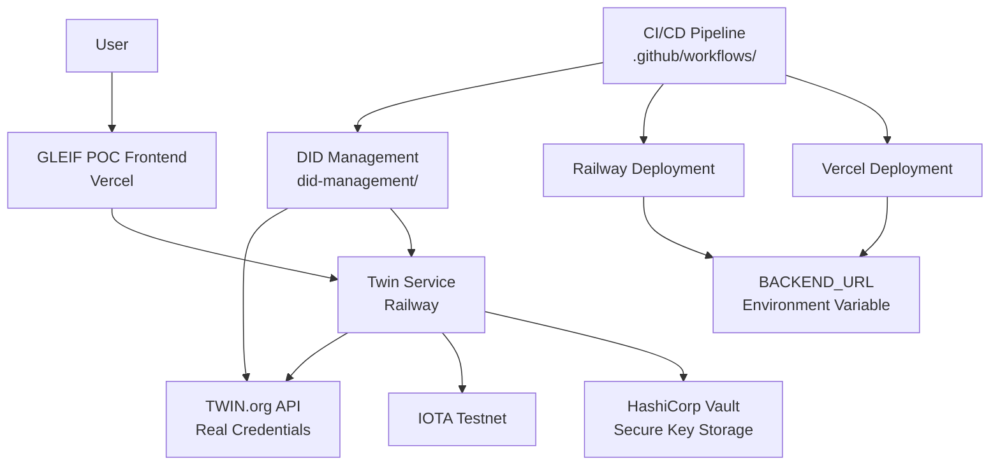

# GLEIF POC: vLEI ↔ TWIN ID Linkage Verifier

## Overview

This Proof of Concept (PoC) demonstrates the integration of **vLEI** (verifiable Legal Entity Identifiers) from the Global Legal Entity Identifier Foundation (GLEIF) with **TWIN IDs** (decentralized identities) on the IOTA testnet. The project showcases an end-to-end verification flow for bi-directional linkage between a TWIN ID and its corresponding vLEI, enabling trustless verification of legal entity identities in a decentralized manner using real blockchain operations.

The PoC includes:
- A Next.js-based web application for user interaction and verification.
- A backend service (`twin-service`) for DID management and NFT operations with HashiCorp Vault integration for production security.
- Automated DID management scripts for creating and linking identities on the IOTA testnet.
- Real KERI (Key Event Receipt Infrastructure) credentials generated from TWIN.org API operations.
- CI/CD pipeline with automated credential generation and Vercel deployment.

## Purpose

The primary goal of this PoC is to explore and validate the feasibility of:
- Linking traditional legal entity identifiers (LEIs) with decentralized identities (DIDs).
- Implementing bi-directional verification between vLEI credentials and TWIN IDs.
- Demonstrating secure, decentralized identity verification using IOTA's Tangle and TWIN SDK.
- Integrating secure key management with HashiCorp Vault for production deployments.

This project serves as a foundation for future implementations of decentralized legal entity verification, potentially integrating with GLEIF's vLEI infrastructure.

## Recent Improvements

### Vault Integration for Production Security
- **Secure Key Storage**: HashiCorp Vault integration for secure storage of wallet seeds and DID private keys in production environments.
- **Production Security**: Environment-based configuration optimized for Vault-backed secure operations.
- **Real Blockchain Operations**: All DID and NFT operations now use real IOTA testnet transactions.

### Automated Credential Generation with TWIN.org API
- **CI/CD Pipeline**: GitHub Actions workflow that automatically generates fresh credentials using real TWIN.org API operations.
- **Build-time Credential Generation**: Next.js prebuild script ensures real KERI credentials are available before deployment.
- **Dynamic DID Linking**: Scripts that create new IOTA testnet DIDs and link them with real vLEI credentials from TWIN.org.

### CI/CD Enhancements
- **Automated Deployment**: GitHub Actions workflow for Vercel deployment with real credential generation.
- **Credential Verification**: Build-time checks ensure required KERI files are present and valid.
- **Environment Secrets**: Secure handling of Vercel deployment tokens and TWIN.org API credentials.

### IOTA Explorer Integration
- **Blockchain Transparency**: Direct links to view DIDs, NFTs, and wallet addresses on the official IOTA explorer.
- **User Experience Enhancement**: One-click access to blockchain artifacts for verification transparency.
- **Official IOTA Stiftung Utilities**: Integration with official IOTA explorer utilities for reliable link generation.
- **Network-Aware Links**: Automatic network detection (testnet/mainnet) for accurate explorer routing.
- **Multi-Artifact Support**: Links for original DIDs, attestation DIDs, NFT attestations, and issuer addresses.

## Architecture

The project is structured into four main components:

### 1. GLEIF POC Frontend (`gleif-poc/`)
- **Framework**: Next.js 15 with React 19
- **Purpose**: Web interface for TWIN ID verification with blockchain transparency
- **Key Features**:
  - User input for TWIN DID
  - API integration for verification
  - Real-time status display
  - **Blockchain Explorer Links**: Direct access to view DIDs, NFTs, and addresses on IOTA explorer
  - WebAssembly support for cryptographic operations
- **Technologies**: TypeScript, Tailwind CSS, Next.js API Routes
- **Build Features**: Automated credential generation during build process

### 2. Twin Service (`twin-service/`)
- **Framework**: Node.js with Express
- **Purpose**: Backend service for real DID and NFT operations on IOTA testnet with secure key management
- **Security**: HashiCorp Vault integration for production-grade cryptographic key storage and seed management
- **Endpoints**:
  - `POST /create-did`: Create new TWIN DID on IOTA testnet
  - `GET /resolve-did/:did`: Resolve DID document from IOTA network
  - `POST /mint-nft`: Mint NFT attestation on IOTA testnet
  - `POST /transfer-nft`: Transfer NFT on IOTA testnet
- **Technologies**: JavaScript, Express, TWIN SDK, HashiCorp Vault

### 3. DID Management (`did-management/`)
- **Purpose**: Scripts for identity creation and automated credential generation using TWIN.org API
- **Components**:
  - `manage-did.js`: Create and update TWIN IDs with vLEI links on IOTA testnet
  - `generate-credentials.sh`: Generate real KERI credentials from TWIN.org API linked to DIDs
  - `twin-wallet.json`: Wallet storage for TWIN operations
- **Automation**: CI/CD integration for fresh credential generation on each deployment
- **Technologies**: Node.js, Bash

### 4. Twin Webinar Demo (`twin-webinar2-demo/`)
- **Purpose**: Comprehensive demo environment with multiple participants and data spaces
- **Features**: Pre-configured identities, credentials, and compliance templates
- **Components**: Data resources, service offerings, participant credentials
- **Use Case**: Full-scale demonstration of decentralized data spaces

### Architecture Diagram



### Dependencies
- **IOTA SDK**: For blockchain interactions and Tangle connectivity on testnet
- **TWIN SDK**: For identity, wallet, and NFT operations on IOTA testnet
- **HashiCorp Vault**: Secure key storage for production environments
- **KERI Protocol**: For real credential verification from TWIN.org API
- **WebAssembly**: For cryptographic operations in the browser
- **IOTA Stiftung Explorer Utilities**: Official utilities for generating blockchain explorer links (DIDs, NFTs, addresses)

## Prerequisites

- Node.js 18+ and npm
- Access to IOTA testnet (configured in `config.env`)
- HashiCorp Vault instance (local or cloud) for secure key management
- Basic understanding of DIDs and decentralized identity concepts
- Git for version control

## Setup Instructions

### 1. Clone and Install Dependencies

```bash
# Clone the repository
git clone <repository-url>
cd gleif-poc

# Install dependencies for all components
npm run install:all
```

This command will install dependencies for:
- Main frontend application (`gleif-poc/`)
- Twin service (`twin-service/`)
- DID management scripts (`did-management/`)

### 2. Configure Environment

Copy and update configuration files as needed:
- `config.env`: IOTA network settings
- `identity.env`: Default DID (if applicable)
- `gleif-poc/.env.local`: Local environment variables for Next.js
  - `IOTA_NETWORK`: IOTA network name (testnet/mainnet/devnet, defaults to testnet)
  - `IDENTITY_IOTA_EXPLORER_ENDPOINT`: IOTA explorer URL (defaults to https://explorer.iota.org)
- `twin-service/.env`: Twin service configuration

### 3. Local Development Setup

#### Development with Vault Integration
```bash
# Start HashiCorp Vault (Docker)
docker run -d --name vault-dev -p 8200:8200 \
  -e VAULT_DEV_ROOT_TOKEN_ID=root \
  hashicorp/vault server -dev

# Configure Vault environment
cd twin-service
cp .env.vault .env

# Start all services with Vault integration
npm run dev:vault
```

This starts:
- Frontend: http://localhost:3000
- Twin Service with Vault: http://localhost:3001
- Vault UI: http://localhost:8200

### 4. Generate Credentials (Development)

For local development with real TWIN.org API credentials, first start the twin-service, then generate a DID using manage-did.js, and finally generate the credentials.
```bash
# In one terminal:
cd twin-service && npm run start:vault

# In a new terminal:
cd ../did-management && node manage-did.js && ./generate-credentials.sh $(jq -r '.did' twin-wallet.json)
```

This generates real KERI credentials from TWIN.org API linked to the created DID in `gleif-poc/public/.well-known/keri/`.

### 5. Test the Setup

To test the setup:

1. Access the frontend at http://localhost:3000
2. Retrieve the DID using the following command:
   ```bash
   cd ..
   jq -r '.did' did-management/twin-wallet.json
   ```
3. Paste the DID into the frontend input field to test verification.

This validates the DID linkage with vLEI credentials.
## Deployment Instructions

### Monorepo Deployment Architecture

This project uses a **monorepo deployment strategy** with separate hosting platforms for optimal performance and scalability:

- **Frontend** (`gleif-poc/`): Deployed to **Vercel** for global CDN, serverless functions, and optimal Next.js performance
- **Backend** (`twin-service/`): Deployed to **Railway** for reliable containerized hosting with persistent services

The deployment workflow automatically:
1. Generates fresh IOTA DIDs and KERI credentials
2. Deploys the backend to Railway
3. Retrieves the Railway service URL
4. Deploys the frontend to Vercel with the backend URL configured
5. Sets up cross-service communication via environment variables

### Required GitHub Secrets

Configure the following secrets in your GitHub repository settings:

#### Vercel Secrets
- `VERCEL_TOKEN`: Vercel authentication token
- `VERCEL_ORG_ID`: Vercel organization ID
- `VERCEL_PROJECT_ID`: Vercel project ID for the frontend

#### Railway Secrets
- `RAILWAY_TOKEN`: Railway CLI authentication token

### Environment Variable Configuration

#### Cross-Service Communication
The frontend communicates with the backend via the `BACKEND_URL` environment variable:
- **Development**: `http://localhost:3001` (local twin-service)
- **Production**: Automatically set to Railway service URL during deployment

#### Backend Environment Variables (Railway)
```bash
VAULT_ENABLED=true
VAULT_ENDPOINT=<production-vault-url>
VAULT_TOKEN=<production-vault-token>
NETWORK=testnet  # or mainnet for production
NODE_URL=https://api.testnet.iota.cafe
```

### Manual Setup Steps

#### 1. Create Vercel Project
```bash
# Install Vercel CLI
npm install -g vercel

# Login to Vercel
vercel login

# Connect and deploy frontend
cd gleif-poc
vercel --prod
```

#### 2. Create Railway Project
```bash
# Install Railway CLI
npm install -g @railway/cli

# Login to Railway
railway login

# Initialize Railway project
cd twin-service
railway init

# Set environment variables
railway variables set VAULT_ENABLED=true
railway variables set VAULT_ENDPOINT=<your-vault-endpoint>
railway variables set VAULT_TOKEN=<your-vault-token>
railway variables set NETWORK=testnet

# Deploy
railway deploy
```

#### 3. Configure Cross-Service Communication
After Railway deployment, get the service URL:
```bash
cd twin-service
railway domain
```

Then set in Vercel:
```bash
cd gleif-poc
vercel env add BACKEND_URL production
# Enter the Railway URL when prompted
```

### GitHub Actions Dual Deployment Workflow

The CI/CD pipeline (`.github/workflows/deploy.yml`) handles automated dual deployments:

1. **Credential Generation**: Creates fresh IOTA DIDs and KERI credentials
2. **Frontend Deployment**: Deploys `gleif-poc/` to Vercel
3. **Backend Deployment**: Deploys `twin-service/` to Railway
4. **Service Discovery**: Retrieves Railway service URL
5. **Environment Configuration**: Sets `BACKEND_URL` in Vercel to Railway URL

**Trigger**: Push to `main` branch automatically deploys both services.

### Local Development with Deployed Backend

For testing frontend changes against production backend:

```bash
# Set local environment to use deployed backend
cd gleif-poc
echo "BACKEND_URL=https://your-railway-service.up.railway.app" > .env.local

# Start frontend only
npm run dev
```

This allows you to:
- Test frontend changes quickly
- Use production backend services
- Debug integration issues
- Validate deployment configurations

### Production Deployment Workflow

#### Automatic Deployment (Recommended)
1. Push changes to `main` branch
2. GitHub Actions automatically:
   - Generates fresh credentials
   - Deploys backend to Railway
   - Deploys frontend to Vercel
   - Configures service communication

#### Manual Production Deployment
```bash
# Deploy backend first
cd twin-service
railway deploy

# Get new Railway URL
RAILWAY_URL=$(railway domain)

# Deploy frontend with new backend URL
cd ../gleif-poc
echo "$RAILWAY_URL" | vercel env add BACKEND_URL production --force
vercel --prod --yes
```

#### Production Environment Setup
```bash
# Update configuration files for production
cp config.env config.prod.env
# Edit config.prod.env with production IOTA network settings

# Configure Vault for production
cd twin-service
cp .env.vault .env.prod
# Edit .env.prod with production Vault settings
```

**Production Checklist**:
- [ ] Vault configured with production credentials
- [ ] Railway environment variables set
- [ ] Vercel environment variables configured
- [ ] IOTA network set to `mainnet`
- [ ] Domain configured (optional)
- [ ] SSL certificates verified

## Vault Integration for Secure Operations

### Development Environment with Vault
For development with production-like security:

```bash
# Start Vault
docker run -d --name vault-dev -p 8200:8200 \
  -e VAULT_DEV_ROOT_TOKEN_ID=root \
  vault server -dev

# Configure environment
cd twin-service
cp .env.vault .env

# Start with Vault
npm run dev:vault

# Services run with real IOTA testnet operations
# - Secure key storage via Vault
# - Real blockchain transactions
# - Production-grade security
```

**Use Case**: Development, integration testing, security validation

### Production Environment with Vault
For production deployments:

```bash
# Configure production Vault
cd twin-service
cp .env.vault .env.prod
# Edit .env.prod with production Vault settings

# Start production service
npm run start:vault
```

**Use Case**: Production deployments with enterprise security

## Production Vault Deployment Options

This section provides comprehensive guidance for deploying HashiCorp Vault in production environments for the GLEIF POC system. The twin-service uses Vault for secure storage of wallet seeds and DID private keys, ensuring enterprise-grade security for cryptographic operations.

### 1. HashiCorp Cloud Platform (HCP) Vault - Recommended Managed Solution

HCP Vault is the recommended production solution, providing a fully managed, enterprise-ready Vault service with automated backups, scaling, and compliance features.

#### Prerequisites
- HCP account with billing enabled
- HCP CLI installed (`brew install hashicorp/tap/hcp`)
- HCP project created

#### Setup Steps

1. **Create HCP Vault Cluster**
```bash
# Login to HCP
hcp auth login

# Create a Vault cluster
hcp vault create my-gleif-vault \
  --hvn-id hvn-abc123 \
  --tier standard \
  --cluster-id gleif-poc-vault

# Get cluster details
hcp vault describe gleif-poc-vault
```

2. **Configure Vault Authentication**
```bash
# Enable AppRole authentication method
vault auth enable approle

# Create a policy for the twin-service
vault policy write twin-service-policy - <<EOF
path "secret/data/wallet/*" {
  capabilities = ["create", "read", "update", "delete"]
}
path "secret/data/did/*" {
  capabilities = ["create", "read", "update", "delete"]
}
EOF

# Create AppRole for twin-service
vault write auth/approle/role/twin-service \
  token_policies="twin-service-policy" \
  token_ttl=1h \
  token_max_ttl=4h
```

3. **Configure Environment Variables**
```bash
# Production environment configuration
VAULT_ENABLED=true
VAULT_ENDPOINT=https://gleif-poc-vault.vault.abc123.hcp.zone:8200
VAULT_TOKEN=<approle-token>
VAULT_NAMESPACE=  # Leave empty for HCP
VAULT_ROLE_ID=<role-id>
VAULT_SECRET_ID=<secret-id>
NETWORK=mainnet
NODE_URL=https://api.mainnet.iota.cafe
```

4. **Deploy to Railway**
```bash
cd twin-service

# Set Railway environment variables
railway variables set VAULT_ENABLED=true
railway variables set VAULT_ENDPOINT=https://gleif-poc-vault.vault.abc123.hcp.zone:8200
railway variables set VAULT_ROLE_ID=<role-id>
railway variables set VAULT_SECRET_ID=<secret-id>
railway variables set NETWORK=mainnet
railway variables set NODE_URL=https://api.mainnet.iota.cafe

# Deploy
railway deploy
```

#### Security Benefits
- **Managed Service**: No infrastructure management required
- **Automated Backups**: Built-in backup and disaster recovery
- **Compliance**: SOC 2 Type II, PCI DSS, and HIPAA compliant
- **Scaling**: Automatic scaling based on demand
- **Monitoring**: Built-in monitoring and alerting

#### Cost Considerations
- **Standard Tier**: ~$0.18/hour (~$130/month)
- **Plus Tier**: ~$0.35/hour (~$255/month) - includes advanced features
- **Enterprise Tier**: Custom pricing for large deployments

### 2. Self-Hosted Vault on Cloud Infrastructure

For organizations requiring full control over their Vault infrastructure, self-hosted deployments on major cloud providers offer maximum flexibility and compliance options.

#### AWS Deployment

1. **Infrastructure Setup**
```bash
# Create VPC and security groups
aws ec2 create-vpc --cidr-block 10.0.0.0/16
aws ec2 create-security-group --group-name vault-sg --description "Vault security group"

# Launch EC2 instance
aws ec2 run-instances \
  --image-id ami-0abcdef1234567890 \
  --count 1 \
  --instance-type t3.medium \
  --key-name my-key-pair \
  --security-group-ids sg-12345678 \
  --subnet-id subnet-12345678
```

2. **Install Vault**
```bash
# Install Vault
wget -O- https://apt.releases.hashicorp.com/gpg | sudo gpg --dearmor -o /usr/share/keyrings/hashicorp-archive-keyring.gpg
echo "deb [signed-by=/usr/share/keyrings/hashicorp-archive-keyring.gpg] https://apt.releases.hashicorp.com jammy main" | sudo tee /etc/apt/sources.list.d/hashicorp.list
sudo apt update && sudo apt install vault

# Configure Vault
sudo tee /etc/vault.d/vault.hcl > /dev/null <<EOF
storage "dynamodb" {
  ha_enabled = "true"
  region     = "us-east-1"
  table      = "vault-data"
}

listener "tcp" {
  address     = "0.0.0.0:8200"
  tls_cert_file = "/opt/vault/tls/vault.crt"
  tls_key_file  = "/opt/vault/tls/vault.key"
}

seal "awskms" {
  region     = "us-east-1"
  kms_key_id = "alias/vault-kms-key"
}
EOF
```

3. **Initialize and Configure**
```bash
# Initialize Vault
vault operator init -key-shares=5 -key-threshold=3

# Unseal Vault (run for each unseal key)
vault operator unseal

# Enable authentication methods
vault auth enable aws
vault auth enable approle

# Create IAM role for EC2 authentication
vault write auth/aws/role/ec2-role \
  auth_type=ec2 \
  policies=twin-service-policy \
  bound_ami_id=ami-0abcdef1234567890
```

#### GCP Deployment

1. **Infrastructure Setup**
```bash
# Create VPC network
gcloud compute networks create vault-network --subnet-mode=custom

# Create subnet
gcloud compute networks subnets create vault-subnet \
  --network=vault-network \
  --range=10.0.0.0/24 \
  --region=us-central1

# Create GCE instance
gcloud compute instances create vault-instance \
  --zone=us-central1-a \
  --machine-type=n1-standard-1 \
  --network=vault-network \
  --subnet=vault-subnet \
  --tags=vault-server
```

2. **Install and Configure Vault**
```bash
# Install Vault
curl -fsSL https://apt.releases.hashicorp.com/gpg | sudo apt-key add -
sudo apt-add-repository "deb [arch=amd64] https://apt.releases.hashicorp.com $(lsb_release -cs) main"
sudo apt-get update && sudo apt-get install vault

# Configure Vault with GCS backend
sudo tee /etc/vault.d/vault.hcl > /dev/null <<EOF
storage "gcs" {
  bucket = "vault-storage-bucket"
  ha_enabled = "true"
}

listener "tcp" {
  address     = "0.0.0.0:8200"
  tls_cert_file = "/opt/vault/tls/vault.crt"
  tls_key_file  = "/opt/vault/tls/vault.key"
}

seal "gcpckms" {
  project    = "my-project"
  region     = "us-central1"
  key_ring   = "vault-keyring"
  crypto_key = "vault-key"
}
EOF
```

#### Azure Deployment

1. **Infrastructure Setup**
```bash
# Create resource group
az group create --name vault-rg --location eastus

# Create VNet
az network vnet create \
  --resource-group vault-rg \
  --name vault-vnet \
  --address-prefix 10.0.0.0/16 \
  --subnet-name vault-subnet \
  --subnet-prefix 10.0.0.0/24

# Create VM
az vm create \
  --resource-group vault-rg \
  --name vault-vm \
  --image Ubuntu2204 \
  --admin-username azureuser \
  --generate-ssh-keys \
  --vnet-name vault-vnet \
  --subnet vault-subnet \
  --size Standard_B2s
```

2. **Install and Configure Vault**
```bash
# Install Vault
curl -fsSL https://apt.releases.hashicorp.com/gpg | sudo apt-key add -
sudo apt-add-repository "deb [arch=amd64] https://apt.releases.hashicorp.com $(lsb_release -cs) main"
sudo apt-get update && sudo apt-get install vault

# Configure Vault with Azure storage
sudo tee /etc/vault.d/vault.hcl > /dev/null <<EOF
storage "azure" {
  accountName = "vaultstorageaccount"
  accountKey  = "storage-account-key"
  container   = "vault-data"
  environment = "AzurePublicCloud"
}

listener "tcp" {
  address     = "0.0.0.0:8200"
  tls_cert_file = "/opt/vault/tls/vault.crt"
  tls_key_file  = "/opt/vault/tls/vault.key"
}

seal "azurekeyvault" {
  vault_name     = "vault-keyvault"
  key_name       = "vault-key"
  resource_group = "vault-rg"
}
EOF
```

### 3. Docker-Based Production Vault

For containerized deployments, Docker provides a consistent and portable Vault solution suitable for Kubernetes or container orchestration platforms.

#### Docker Compose Production Setup

```yaml
# docker-compose.prod.yml
version: '3.8'
services:
  vault:
    image: hashicorp/vault:${VAULT_VERSION}
    container_name: vault-prod
    restart: unless-stopped
    ports:
      - "8200:8200"
    environment:
      VAULT_ADDR: https://0.0.0.0:8200
      VAULT_API_ADDR: https://vault.example.com:8200
      VAULT_CLUSTER_ADDR: https://vault.example.com:8201
    volumes:
      - vault_data:/vault/data
      - vault_logs:/vault/logs
      - ./vault.hcl:/vault/config/vault.hcl:ro
      - ./tls:/vault/tls:ro
    cap_add:
      - IPC_LOCK
    command: server
    healthcheck:
      test: ["CMD", "vault", "status"]
      interval: 30s
      timeout: 10s
      retries: 3

volumes:
  vault_data:
    driver: local
  vault_logs:
    driver: local
```

#### Production Vault Configuration

```hcl
# vault.hcl
storage "file" {
  path = "/vault/data"
}

listener "tcp" {
  address         = "0.0.0.0:8200"
  cluster_address = "0.0.0.0:8201"
  tls_cert_file   = "/vault/tls/vault.crt"
  tls_key_file    = "/vault/tls/vault.key"
}

api_addr     = "https://vault.example.com:8200"
cluster_addr = "https://vault.example.com:8201"

seal "pkcs11" {
  lib            = "/usr/lib/softhsm/libsofthsm2.so"
  slot           = "0"
  pin            = "1234"
  key_label      = "vault-hsm-key"
  hmac_key_label = "vault-hsm-hmac-key"
}

telemetry {
  prometheus_retention_time = "30s"
  disable_hostname          = true
}
```

#### Kubernetes Deployment

```yaml
# vault-deployment.yaml
apiVersion: apps/v1
kind: Deployment
metadata:
  name: vault
  namespace: security
spec:
  replicas: 3
  selector:
    matchLabels:
      app: vault
  template:
    metadata:
      labels:
        app: vault
    spec:
      serviceAccountName: vault-auth
      containers:
      - name: vault
        image: hashicorp/vault:${VAULT_VERSION}
        ports:
        - containerPort: 8200
          name: vault-port
        - containerPort: 8201
          name: cluster-port
        env:
        - name: VAULT_ADDR
          value: "https://0.0.0.0:8200"
        volumeMounts:
        - name: vault-config
          mountPath: /vault/config
        - name: vault-data
          mountPath: /vault/data
        - name: vault-tls
          mountPath: /vault/tls
        securityContext:
          capabilities:
            add: ["IPC_LOCK"]
      volumes:
      - name: vault-config
        configMap:
          name: vault-config
      - name: vault-data
        persistentVolumeClaim:
          claimName: vault-data-pvc
      - name: vault-tls
        secret:
          secretName: vault-tls
```

### 4. Environment Variable Configuration for Production Vault

#### Core Vault Configuration
```bash
# Required for all production deployments
VAULT_ENABLED=true
VAULT_ENDPOINT=https://vault.example.com:8200
VAULT_TOKEN=<vault-token>  # For token auth
VAULT_ROLE_ID=<role-id>    # For AppRole auth
VAULT_SECRET_ID=<secret-id> # For AppRole auth
VAULT_NAMESPACE=<namespace> # For HCP or enterprise Vault

# IOTA Network Configuration
NETWORK=mainnet
NODE_URL=https://api.mainnet.iota.cafe

# TLS Configuration (if using custom certificates)
VAULT_CACERT=/path/to/ca.crt
VAULT_CAPATH=/path/to/ca/dir
VAULT_CLIENT_CERT=/path/to/client.crt
VAULT_CLIENT_KEY=/path/to/client.key
VAULT_TLS_SERVER_NAME=vault.example.com

# Performance and Timeout Settings
VAULT_MAX_RETRIES=3
VAULT_TIMEOUT=30s
VAULT_RATE_LIMIT=500  # requests per second
```

#### Authentication Method Configurations

**Token Authentication:**
```bash
VAULT_TOKEN=s.abc123def456ghi789
```

**AppRole Authentication:**
```bash
VAULT_ROLE_ID=abcd1234-5678-90ef-ghij-klmnopqrstuv
VAULT_SECRET_ID=wxyz9876-5432-10fe-dcba-zyxwvutsrqpo
```

**AWS IAM Authentication:**
```bash
VAULT_AUTH_METHOD=aws
AWS_REGION=us-east-1
AWS_ROLE_ARN=arn:aws:iam::123456789012:role/vault-role
```

**Kubernetes Authentication:**
```bash
VAULT_AUTH_METHOD=kubernetes
VAULT_K8S_MOUNT_PATH=kubernetes
VAULT_K8S_ROLE=twin-service
```

#### Railway Deployment Configuration
```bash
# Set environment variables in Railway
railway variables set VAULT_ENABLED=true
railway variables set VAULT_ENDPOINT=https://vault.example.com:8200
railway variables set VAULT_ROLE_ID=<role-id>
railway variables set VAULT_SECRET_ID=<secret-id>
railway variables set NETWORK=mainnet
railway variables set NODE_URL=https://api.mainnet.iota.cafe
```

### 5. Security Considerations for Production Deployment

#### Access Control and Authentication
- **Principle of Least Privilege**: Create specific policies for twin-service access
- **AppRole Authentication**: Use AppRole for machine-to-machine authentication
- **Token Rotation**: Implement automatic token rotation policies
- **Multi-Factor Authentication**: Enable MFA for administrative access

#### Network Security
- **TLS Encryption**: Always use TLS 1.3 for all Vault communications
- **Network Segmentation**: Deploy Vault in private subnets
- **Firewall Rules**: Restrict access to necessary ports only
- **VPN Access**: Require VPN for administrative access

#### Data Protection
- **Encryption at Rest**: Use cloud provider KMS or HSM for encryption
- **Backup Strategy**: Implement regular backups with encryption
- **Key Rotation**: Regular rotation of encryption keys
- **Data Classification**: Classify sensitive data appropriately

#### Monitoring and Auditing
- **Audit Logging**: Enable comprehensive audit logging
- **Metrics Collection**: Monitor Vault performance and health
- **Alerting**: Set up alerts for security events
- **Log Aggregation**: Centralize logs for analysis

#### High Availability and Disaster Recovery
- **Clustering**: Deploy Vault in HA mode with auto-unseal
- **Load Balancing**: Use load balancers for client connections
- **Backup Automation**: Automated backups to secure locations
- **Disaster Recovery**: Test disaster recovery procedures regularly

#### Compliance Considerations
- **Regulatory Compliance**: Ensure compliance with relevant regulations (GDPR, SOX, etc.)
- **Security Assessments**: Regular security assessments and penetration testing
- **Incident Response**: Documented incident response procedures
- **Change Management**: Controlled change management processes

#### Performance Optimization
- **Resource Allocation**: Adequate CPU and memory for expected load
- **Connection Pooling**: Configure appropriate connection limits
- **Caching**: Implement caching where appropriate
- **Rate Limiting**: Protect against abuse with rate limiting

### 6. Production Deployment Checklist

#### Pre-Deployment
- [ ] Vault infrastructure provisioned and configured
- [ ] TLS certificates obtained and installed
- [ ] Authentication methods configured
- [ ] Policies and roles created
- [ ] Backup strategy implemented
- [ ] Monitoring and alerting configured

#### Deployment
- [ ] Environment variables configured in Railway
- [ ] Application deployed successfully
- [ ] Vault connectivity verified
- [ ] DID creation and resolution tested
- [ ] NFT minting functionality validated

#### Post-Deployment
- [ ] Security testing completed
- [ ] Performance benchmarks established
- [ ] Documentation updated
- [ ] Team trained on operations
- [ ] Monitoring dashboards verified

#### Maintenance
- [ ] Regular security updates applied
- [ ] Backup integrity verified
- [ ] Performance monitoring active
- [ ] Incident response procedures tested
- [ ] Compliance audits completed

## Usage Guide

### Verifying a TWIN ID Linkage

1. **Access the Application**: Open the frontend at `http://localhost:3000`.

2. **Enter TWIN DID**: Input a valid TWIN DID created using the twin-service API.

3. **Verify Linkage**: Click "Verify Linkage" to check bi-directional link to vLEI.

4. **View Results**:
   - ✅ **VERIFIED**: Successful linkage with NFT attestation on IOTA testnet
   - ❌ **NOT VERIFIED**: Linkage verification failed
   - 🔥 **ERROR**: System or network error

### Viewing Blockchain Artifacts on IOTA Explorer

The application provides direct links to view blockchain artifacts on the official IOTA explorer, supporting verified endpoints for comprehensive transparency:

#### Verified IOTA Explorer Endpoints
- **`/object/`**: For viewing DID documents and other IOTA objects
- **`/addr/`**: For viewing wallet addresses and their transactions
- **`/nft/`**: For viewing NFT attestations and their metadata
- **`/tx/`**: For viewing individual transactions

#### Network-Aware Explorer URLs
The explorer utilities automatically detect and route to the appropriate network:
- **Testnet**: `https://explorer.iota.org` (default for development)
- **Mainnet**: `https://explorer.rebased.iota.org` (for production deployments)

Network detection is based on:
- Environment variable `IOTA_NETWORK` (testnet/mainnet/devnet)
- DID-embedded network information extracted from `did:iota:network:objectId` format
- Fallback to configured defaults

#### Updated Explorer Link Generation Logic
The explorer link generation has been simplified and optimized:

```typescript
// DID links use /object/ endpoint
generateExplorerLink(did, network?) // → /object/{objectId}?network={network}

// NFT links use dedicated /nft/ endpoint
getNftExplorerUrl(nftId) // → /nft/{nftId}?network={network}

// Address links use /addr/ endpoint
getAddressExplorerUrl(address) // → /addr/{address}?network={network}

// Transaction links use /tx/ endpoint
getTransactionExplorerUrl(txId) // → /tx/{txId}?network={network}
```

#### Simplified Implementation
Redundant functions have been removed and the implementation streamlined to use:
- Single source of truth for explorer host configuration
- Consistent network parameter handling
- Official IOTA Stiftung explorer utilities
- Environment-based configuration with sensible defaults

When verification succeeds, users can access:
- **🔗 View Original DID Document**: Links to the TWIN DID using `/object/` endpoint
- **🔗 View Attestation DID Document**: Links to the attestation DID using `/object/` endpoint
- **🖼️ View NFT Attestation**: Links to the NFT using `/nft/` endpoint
- **👛 View Issuer Wallet Address**: Links to the issuer address using `/addr/` endpoint

### Explorer Integration UI Examples

When a TWIN ID verification succeeds, users see a "Blockchain Explorer Links" section with interactive buttons:

```
✅ VERIFIED

Blockchain Explorer Links
🔗 View Original DID Document
🔗 View Attestation DID Document
🖼️ View NFT Attestation
👛 View Issuer Wallet Address
```

Each button opens the corresponding artifact in a new browser tab on the IOTA explorer, providing complete transparency into the blockchain operations that underpin the vLEI ↔ TWIN ID linkage verification.

### API Usage

#### Verification Endpoint
```bash
curl -X POST http://localhost:3000/api/verify \
  -H "Content-Type: application/json" \
  -d '{"did": "did:iota:AbCdEfGhIjKlMnOpQrStUvWxYz..."}'
```

Response:
```json
{
  "status": "VERIFIED",
  "attestationDid": "did:iota:...",
  "nftId": "nft:...",
  "reason": "Verification successful"
}
```

#### Twin Service API

```bash
# Create a new DID
curl -X POST http://localhost:3001/create-did

# Resolve a DID
curl http://localhost:3001/resolve-did/did:iota:example

# Mint an NFT
curl -X POST http://localhost:3001/mint-nft \
  -H "Content-Type: application/json" \
  -d '{
    "issuerAddress": "iota1...",
    "immutableData": "verification data",
    "metadata": {"type": "attestation"}
  }'
```

## End-to-End Testing Procedures

### Automated Testing
The CI/CD pipeline performs automated testing on each deployment:

1. **Credential Generation Test**: Verifies KERI files are created correctly
2. **DID Creation Test**: Ensures DID management scripts work
3. **Build Test**: Confirms Next.js application builds successfully
4. **Deployment Test**: Validates Vercel deployment completes

### Manual End-to-End Testing

#### Test Scenario 1: Real TWIN Verification Flow
```bash
# 1. Start services with Vault
npm run dev:vault

# 2. Generate real credentials from TWIN.org API
cd did-management
./generate-credentials.sh

# 3. Create a TWIN DID
node manage-did.js

# 4. Test verification with real DID
curl -X POST http://localhost:3000/api/verify \
  -H "Content-Type: application/json" \
  -d '{"did": "did:iota:AbCdEfGhIjKlMnOpQrStUvWxYz..."}'

# Expected: VERIFIED status with real attestation details
```

#### Test Scenario 2: Vault Integration Test
```bash
# 1. Start Vault
docker run -d --name vault-dev -p 8200:8200 \
  -e VAULT_DEV_ROOT_TOKEN_ID=root vault server -dev

# 2. Configure Vault
cd twin-service
cp .env.vault .env

# 3. Start with Vault
npm run start:vault

# 4. Test DID creation
curl -X POST http://localhost:3001/create-did

# 5. Verify Vault storage (check Vault UI at http://localhost:8200)
```

#### Test Scenario 3: Production Deployment Test
```bash
# 1. Test build process
cd gleif-poc
npm run build

# 2. Verify credential files exist
ls -la public/.well-known/keri/

# 3. Test Vercel deployment locally
npx vercel build
npx vercel deploy --prebuilt
```

### Performance Testing
```bash
# Load testing with Apache Bench
ab -n 100 -c 10 http://localhost:3000/api/verify \
  -T 'application/json' \
  -p test-payload.json
```

## Automated Testing Script

The project includes a comprehensive automated end-to-end testing script (`test-e2e.sh`) that validates the complete GLEIF POC system functionality, from environment setup to production readiness.

### Running the Automated Tests

#### Prerequisites
- Node.js 18+
- npm
- Docker (for Vault testing)
- All project dependencies installed

#### Basic Execution
```bash
# Make the script executable (first time only)
chmod +x test-e2e.sh

# Run the complete test suite
./test-e2e.sh
```

The script will automatically:
1. Set up the test environment
2. Start all required services (Vault, Twin Service, Frontend)
3. Execute comprehensive tests
4. Generate detailed reports
5. Clean up resources

#### Test Execution Time
- **Expected Duration**: 5-10 minutes
- **Services Started**: Vault (port 8200), Twin Service (port 3001), Frontend (port 3000)
- **Real Blockchain Operations**: Tests use actual IOTA testnet transactions

### What the Automated Testing Covers

The `test-e2e.sh` script performs comprehensive validation of:

#### 1. Environment Setup
- Node.js and npm availability
- Docker installation (for Vault)
- Port availability checks (3000, 3001, 8200)
- Dependency installation across all components

#### 2. Service Integration
- HashiCorp Vault startup and connectivity
- Twin Service with Vault integration
- GLEIF POC frontend application
- Cross-service communication verification

#### 3. DID Management
- TWIN DID creation on IOTA testnet
- Wallet file generation and validation
- Real blockchain DID registration

#### 4. Credential Generation
- KERI credential creation from TWIN.org API
- Credential file placement in frontend
- Real vLEI integration verification

#### 5. API Functionality
- Twin Service endpoints (`/create-did`, `/resolve-did`, `/mint-nft`)
- Frontend verification API (`/api/verify`)
- JSON response validation and error handling

#### 6. End-to-End Verification Flow
- Complete TWIN ID ↔ vLEI linkage verification
- NFT attestation creation and validation
- Bi-directional verification testing

#### 7. IOTA Explorer Integration
- Blockchain artifact link generation
- DID document accessibility
- NFT and address explorer compatibility

#### 8. Build and Deployment Readiness
- Frontend production build validation
- Credential file presence verification
- Deployment artifact generation

### Interpreting Test Results

#### Test Output Format
```
🚀 Starting GLEIF POC End-to-End Tests
Log file: test-results-20241201-143022.log
Report file: test-report-20241201-143022.md

✅ Environment Setup: PASS
✅ Vault Startup: PASS
✅ Twin Service Startup: PASS
✅ GLEIF POC Startup: PASS
✅ DID Creation: PASS
✅ Credential Generation: PASS
✅ API Endpoints: PASS
✅ Verification Flow: PASS
✅ Explorer Links: PASS
✅ Frontend Build: PASS

📊 Test Summary:
Total Tests: 10
Passed: 10
Failed: 0
🎉 All tests passed! System is ready.
```

#### Success Indicators
- **All tests PASS**: System is fully functional and ready for deployment
- **Green checkmarks (✅)**: Individual test components successful
- **Test Summary**: Shows total passed/failed counts
- **Success Rate**: Percentage of tests that passed

#### Generated Files
- **Log File**: `test-results-YYYYMMDD-HHMMSS.log` - Detailed execution logs
- **Report File**: `test-report-YYYYMMDD-HHMMSS.md` - Human-readable test summary

#### Failure Scenarios
- **Port conflicts**: Script attempts automatic resolution, fails if ports remain occupied
- **Service startup failures**: Indicates configuration or dependency issues
- **API endpoint failures**: Suggests integration problems between services
- **Verification flow failures**: May indicate blockchain connectivity or credential issues

### CI/CD Pipeline Integration

The automated testing script is designed for seamless CI/CD integration:

#### GitHub Actions Integration
```yaml
# .github/workflows/test.yml
name: E2E Tests
on: [push, pull_request]

jobs:
  test:
    runs-on: ubuntu-latest
    steps:
      - uses: actions/checkout@v4
      - uses: actions/setup-node@v4
        with:
          node-version: '18'
      - name: Setup Docker
        run: |
          sudo apt-get update
          sudo apt-get install -y docker.io
      - name: Run E2E Tests
        run: |
          chmod +x test-e2e.sh
          ./test-e2e.sh
      - name: Upload Test Results
        uses: actions/upload-artifact@v4
        if: always()
        with:
          name: test-results
          path: |
            test-results-*.log
            test-report-*.md
```

#### Pre-deployment Validation
```bash
# In deployment scripts
#!/bin/bash
echo "Running pre-deployment validation..."

if ./test-e2e.sh; then
    echo "✅ All tests passed. Proceeding with deployment..."
    # Deploy to staging/production
else
    echo "❌ Tests failed. Aborting deployment."
    exit 1
fi
```

#### Automated Testing Triggers
- **Pull Requests**: Validate changes before merge
- **Main Branch**: Full validation before deployment
- **Scheduled**: Weekly comprehensive testing
- **Manual**: On-demand testing via workflow dispatch

### Troubleshooting Common Test Issues

#### 1. Port Already in Use
**Error**: `Port 3000 is already in use`
**Solution**:
```bash
# Find and stop conflicting processes
lsof -ti:3000 | xargs kill -9
lsof -ti:3001 | xargs kill -9
lsof -ti:8200 | xargs kill -9

# Or change ports in service configurations
```

#### 2. Docker Permission Issues
**Error**: `docker: permission denied`
**Solution**:
```bash
# Add user to docker group
sudo usermod -aG docker $USER
# Logout and login again, or run:
newgrp docker
```

#### 3. Vault Connection Failures
**Error**: `Vault failed to start`
**Solution**:
```bash
# Check Docker is running
docker ps

# Clean up old containers
docker stop vault-dev
docker rm vault-dev

# Verify port availability
lsof -i :8200
```

#### 4. Dependency Installation Failures
**Error**: `npm install failed`
**Solution**:
```bash
# Clear npm cache
npm cache clean --force

# Remove node_modules and reinstall
rm -rf node_modules package-lock.json
npm install

# Check Node.js version compatibility
node --version  # Should be 18+
```

#### 5. DID Creation Failures
**Error**: `DID creation failed`
**Solution**:
- Check IOTA testnet connectivity
- Verify TWIN SDK configuration
- Check Vault connectivity for secure operations
- Review `config.env` and `identity.env` settings

#### 6. Credential Generation Issues
**Error**: `Credential files not found`
**Solution**:
```bash
# Check TWIN.org API connectivity
curl -s https://api.twin.org/health

# Verify DID exists in wallet
cat did-management/twin-wallet.json

# Manual credential generation
cd did-management
./generate-credentials.sh $(jq -r '.did' twin-wallet.json)
```

#### 7. Verification Flow Failures
**Error**: `Verification failed`
**Solution**:
- Check all services are running and accessible
- Verify credential files are in correct location
- Check IOTA network connectivity
- Review application logs for detailed error messages

#### 8. Build Failures
**Error**: `Frontend build failed`
**Solution**:
```bash
# Clear Next.js cache
cd gleif-poc
rm -rf .next

# Check for TypeScript errors
npm run lint

# Verify all dependencies
npm ls --depth=0
```

#### 9. Test Timeout Issues
**Error**: `Service failed to start within X seconds`
**Solution**:
- Increase timeout values in script if needed
- Check system resources (CPU, memory)
- Verify network connectivity for external services
- Run tests on a more powerful machine

#### 10. Log Analysis
**Debug Process**:
```bash
# Check detailed logs
tail -f test-results-*.log

# Search for specific errors
grep "ERROR" test-results-*.log
grep "FAIL" test-results-*.log

# Check service-specific logs
docker logs vault-dev
# Check application logs in respective directories
```

#### Getting Help with Test Issues
1. Review the generated test report for specific failure details
2. Check the detailed log file for stack traces and error messages
3. Verify all prerequisites are met (Node.js, Docker, ports)
4. Test individual components manually before running full suite
5. Check GitHub issues for similar problems
6. Provide detailed error logs when seeking support

## API Documentation

### Frontend API (`/api/verify`)

**Endpoint**: `POST /api/verify`

**Request Body**:
```json
{
  "did": "string" // IOTA DID to verify
}
```

**Response**:
```json
{
  "status": "VERIFIED" | "NOT VERIFIED" | "ERROR",
  "attestationDid": "string?", // Present if VERIFIED
  "nftId": "string?", // Present if VERIFIED
  "reason": "string" // Explanation of result
}
```

**Error Codes**:
- `400`: Missing or invalid DID
- `500`: Internal server error

### Twin Service API

#### `POST /create-did`
Creates a new TWIN DID document.

**Response**:
```json
{
  "success": true,
  "did": {
    "id": "did:iota:...",
    "controller": "did:iota:..."
  }
}
```

#### `GET /resolve-did/:did`
Resolves a DID document from IOTA network.

**Response**:
```json
{
  "success": true,
  "didDocument": {
    "id": "did:iota:...",
    "alsoKnownAs": ["did:webs:..."]
  }
}
```

#### `POST /mint-nft`
Mints a new NFT with immutable data.

**Request Body**:
```json
{
  "issuerAddress": "string",
  "immutableData": "string",
  "metadata": "object?"
}
```

**Response**:
```json
{
  "success": true,
  "nft": {
    "id": "nft:...",
    "issuerAddress": "iota1...",
    "immutableData": "..."
  }
}
```

#### `POST /transfer-nft`
Transfers an NFT to a new owner.

**Request Body**:
```json
{
  "nftId": "string",
  "toAddress": "string",
  "fromAddress": "string",
  "amount": "number?"
}
```

## Troubleshooting Guide

### Common Issues

#### 1. Port Conflicts
**Error**: `Error: listen EADDRINUSE: address already in use`
**Solution**:
```bash
# Find process using port
lsof -i :3000
lsof -i :3001

# Kill process
kill -9 <PID>

# Or change ports in configuration
```

#### 2. Vault Connection Issues
**Error**: `Failed to initialize Vault connector`
**Solution**:
```bash
# Check Vault is running
docker ps | grep vault

# Verify Vault endpoint
curl http://localhost:8200/v1/sys/health

# Check environment variables
cd twin-service
cat .env
```

#### 3. Credential Generation Fails
**Error**: `Credential file not found`
**Solution**:
```bash
# Manual credential generation
cd did-management
chmod +x generate-credentials.sh
./generate-credentials.sh $(jq -r '.did' twin-wallet.json)

# Verify files exist
ls -la ../gleif-poc/public/.well-known/keri/
```

#### 4. DID Resolution Fails
**Error**: `Identity resolver connector not available`
**Solution**:
- Check Vault connectivity and tokens
- Verify IOTA testnet configuration in `config.env`
- Ensure TWIN SDK is properly configured

#### 5. Build Failures
**Error**: `Build failed`
**Solution**:
```bash
# Clear Next.js cache
cd gleif-poc
rm -rf .next

# Reinstall dependencies
npm install

# Check for TypeScript errors
npm run lint
```

#### 6. NFT Minting Issues
**Error**: `Failed to mint NFT`
**Solution**:
- Check wallet balance and funding
- Verify IOTA network connectivity
- Ensure proper permissions in Vault mode

### Debug Commands

```bash
# Check all services status
ps aux | grep -E "(node|npm)"

# View application logs
cd gleif-poc && npm run dev 2>&1 | tee dev.log

# Check Vault status
docker logs vault-dev

# Test API endpoints
curl -X POST http://localhost:3001/create-did
curl http://localhost:3001/resolve-did/did:iota:AbCdEfGhIjKlMnOpQrStUvWxYz...
```

### Environment-Specific Issues

#### Development Environment
- Ensure all ports (3000, 3001, 8200) are available
- Check Node.js version: `node --version`
- Verify npm cache: `npm cache clean --force`

#### Production Environment
- Confirm Vault connectivity and authentication
- Verify IOTA mainnet configuration
- Check SSL certificates for HTTPS
- Validate CORS settings for API access

### Getting Help

1. Check existing GitHub issues
2. Review application logs in detail
3. Test Vault connectivity and configuration
4. Verify IOTA testnet connectivity
5. Provide detailed error messages and environment info when reporting issues


## Contributing

1. Fork the repository
2. Create a feature branch (`git checkout -b feature/amazing-feature`)
3. Make changes and test thoroughly
4. Commit changes (`git commit -m 'Add amazing feature'`)
5. Push to branch (`git push origin feature/amazing-feature`)
6. Open a Pull Request

### Development Guidelines
- Follow TypeScript best practices
- Add tests for new features
- Update documentation for API changes
- Ensure CI/CD pipeline passes
- Test with Vault integration for secure operations

## License

This project is licensed under the MIT License - see the LICENSE file for details.

## Acknowledgments

- GLEIF for the vLEI standard
- IOTA Foundation for the TWIN SDK
- HashiCorp for Vault
- The decentralized identity community for KERI and DID standards
