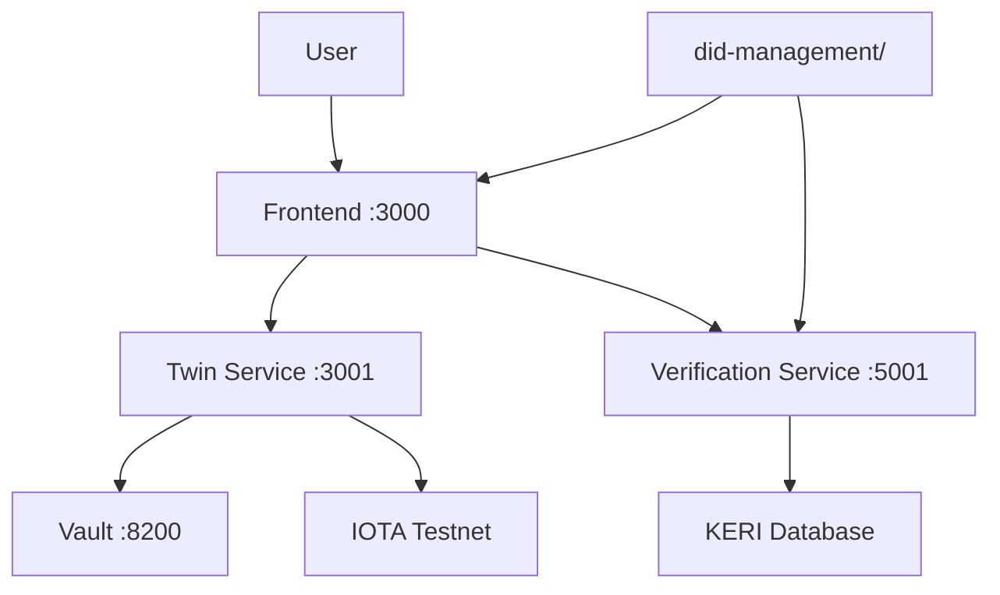
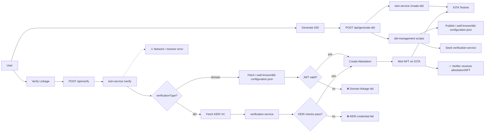

# GLEIF vLEI ↔ TWIN ID Linkage Verifier

## Overview

Verifies organizational identity by linking GLEIF vLEI (`did:webs`) to TWIN ID (`did:iota`) using real KERI cryptographic verification. Two paths:

- **DID Linking (QVI-based):** QVI issues KERI ACDC credential linking `did:webs` ↔ `did:iota`. Trust anchored in QVI.
- **Domain Linkage (self-hosted):** Entity hosts a signed DID configuration at `/.well-known/did-configuration.json`.

**Status:** KERI ops implemented. **Missing for production:** GLEIF QVI accreditation checks, real-time revocation.

---

## Architecture



**Components:**

- **gleif-frontend/** — Next.js UI + public hosting (`/.well-known`) + API proxy
- **twin-service/** — Express: `/create-did`, `/verify`, `/mint-nft`, attestation logic
- **verification-service/** — Flask: KERI ACDC verifier (structure → resolution → signatures → chain → root)
- **did-management/** — `manage-did.js`, `generate-credentials.sh` (produce KERI artifacts + domain credential)
- **IOTA testnet** — DID registry + NFT attestation
- **HashiCorp Vault** (optional) — Transit engine for signing

---

## E2E Flow



**Failure modes (must handle):**

- Domain JWT invalid / origin mismatch
- KERI structure/signature/chain failures
- Credential revoked (handle revocation list / API)
- Resolver or network outage (fallback + retries)
- Vault unavailable or insufficient funds

---

## Production Gaps

| Priority | Feature           | Implementation               | Production Need                           |
| -------- | ----------------- | ---------------------------- | ----------------------------------------- |
| **P0**   | QVI accreditation | Accepts any local credential | GLEIF QVI Registry API check              |
| **P0**   | Revocation checks | Static registry              | Real-time revocation API                  |
| **P1**   | LEI validation    | None                         | Official LEI registry lookup              |
| **P1**   | Resilience        | Basic error handling         | Resolver fallback, retries, rate-limiting |
| **P2**   | Observability     | Minimal logging              | Monitoring, audit logs, secrets rotation  |

---

## Quickstart

**Prerequisites:** Node.js 18+, Python 3.10+, Docker, jq

### With Vault (recommended)

```bash
# 1. Start Vault + Transit Engine
docker run -d --name vault-dev -p 8200:8200 \
  -e VAULT_DEV_ROOT_TOKEN_ID=root hashicorp/vault server -dev
sleep 5
docker exec -e VAULT_ADDR=http://127.0.0.1:8200 vault-dev vault login root
docker exec -e VAULT_ADDR=http://127.0.0.1:8200 vault-dev vault secrets enable transit
docker exec -e VAULT_ADDR=http://127.0.0.1:8200 vault-dev vault write -f transit/keys/wallet-key

# 2. Start backend
cd twin-service && cp .env.vault .env && npm run start:vault

# 3. Generate DID + credentials
cd did-management
node manage-did.js
./generate-credentials.sh $(jq -r '.did' twin-wallet.json)

# 4. Start verification service
export GLEIF_ROOT_AID=$(jq -r '.i' ../gleif-frontend/public/.well-known/keri/gleif-incept.json)
cd ../verification-service && source venv/bin/activate && PORT=5001 python3 app.py

# 5. Start frontend
cd ../gleif-frontend && npm run dev
```

### Without Vault

```bash
# 1. Start backend
cd twin-service && npm run dev

# 2. Generate DID + credentials
cd did-management
node manage-did.js
./generate-credentials.sh $(jq -r '.did' twin-wallet.json)

# 3. Start verification service
export GLEIF_ROOT_AID=$(jq -r '.i' ../gleif-frontend/public/.well-known/keri/gleif-incept.json)
cd ../verification-service && source venv/bin/activate && PORT=5001 python3 app.py

# 4. Start frontend
cd ../gleif-frontend && npm run dev
```

**Services:**

- Frontend: <http://localhost:3000>
- Backend: <http://localhost:3001>
- Verification: <http://localhost:5001>
- Vault: <http://localhost:8200> (if enabled)

---

## Configuration

### Essential Environment Variables

```env
# Backend URL
BACKEND_URL=http://localhost:3001

# Vault integration (optional)
VAULT_ENABLED=true|false
VAULT_ENDPOINT=http://localhost:8200
TRANSIT_KEY_NAME=wallet-key

# IOTA network
NETWORK=testnet|mainnet
NODE_URL=https://api.testnet.iota.cafe
```

See `.env.example` for complete reference.

---

## API Contract

### Frontend API

#### POST /api/verify

```json
// Request
{
  "did": "did:iota:...",
  "verificationType": "domain" | "did"
}

// Response
{
  "status": "success" | "error",
  "attestationDid": "did:iota:...",
  "nftId": "0x...",
  "reason": "..."
}
```

### Backend API

- **POST /create-did** — Create DID, return DID doc
- **POST /mint-nft** — Mint NFT for attestation
- **POST /verify** — Verify linkage (routes to verification-service)

---

## Repository Structure

```text
.
├── gleif-frontend/        # UI + public/.well-known hosting
├── twin-service/          # Express backend (DID/NFT/verification routing)
├── verification-service/  # Flask KERI ACDC verifier
├── did-management/        # DID creation + credential generation scripts
└── test-e2e.sh           # End-to-end tests
```

---

## Troubleshooting

```bash
# Kill busy ports
lsof -ti:3000,3001,5001,8200 | xargs -r kill -9

# Check Vault logs
docker logs vault-dev

# Fix npm issues
npm cache clean --force && rm -rf node_modules && npm install

# Regenerate credentials
cd did-management && ./generate-credentials.sh <DID>

# Restart verification service with fresh GLEIF root
export GLEIF_ROOT_AID=$(jq -r '.i' gleif-frontend/public/.well-known/keri/gleif-incept.json)
cd verification-service && PORT=5001 python3 app.py
```

---

## Testing

```bash
# Run end-to-end tests
./test-e2e.sh

# Manual testing guide
See MANUAL_TESTING_GUIDE.md for detailed test scenarios
```

---

## Next Steps (Recommended Dev Tasks)

1. **P0:** Implement GLEIF QVI accreditation check via API
2. **P0:** Add revocation check API + integration
3. **P1:** Add explicit `verificationType` logging and error codes
4. **P1:** Implement resolver fallback and retry/backoff
5. **P2:** Add monitoring/audit for on-chain writes and secrets access

---

## Standards & Compliance

- **W3C:** DID Core, Verifiable Credentials
- **KERI/ACDC:** Cryptographic chaining and SAID validation
- **GDPR:** Minimal data on-chain, user consent for writes
- **eIDAS:** Align trust anchors and QVI accreditation (roadmap)

---

## Deployment

- **Frontend:** Vercel / Netlify
- **Backend:** Railway / Fly.io
- **Security:** AppRole auth, never commit secrets, rotate regularly

---

## License

MIT

---

## Contributing

1. Fork the repo
2. Create feature branch (`git checkout -b feature/amazing-feature`)
3. Run tests (`./test-e2e.sh`)
4. Commit changes (`git commit -m 'Add amazing feature'`)
5. Push to branch (`git push origin feature/amazing-feature`)
6. Open Pull Request
