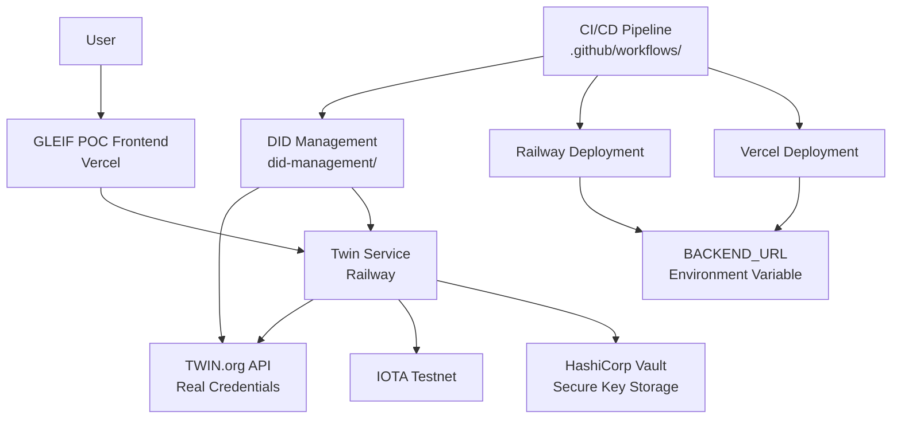

# GLEIF POC — vLEI ↔ TWIN ID Linkage Verifier

This project links a GLEIF vLEI (verifiable Legal Entity Identifier) to a TWIN ID on the IOTA testnet. It features a Next.js frontend, an Express backend, and optional HashiCorp Vault integration for secure DID (Decentralized Identifier) operations.

-----

## ✨ Goals

- Link a vLEI to a TWIN ID and verify the linkage in both directions.
- Ensure minimal local setup requirements (Vault is optional).
- Perform all operations on the real IOTA testnet.

## 🎯 POC Overview

This Proof of Concept (POC) successfully demonstrates **decentralized identity verification** by bridging GLEIF's traditional vLEI (verifiable Legal Entity Identifier) system with IOTA's blockchain-based Decentralized Identifiers (DIDs) and Non-Fungible Tokens (NFTs).

### What the POC Does

1. **Identity Resolution**: Resolves TWIN IDs from the IOTA Distributed Ledger Technology (DLT)
2. **Credential Verification**: Checks linkage between TWIN IDs and vLEI credentials stored in a local credential registry
3. **Blockchain Attestation**: Creates immutable attestations on the IOTA testnet consisting of:
   - **Attestation DID**: A permanent DID document containing the verified identity information
   - **Verification NFT**: An NFT with immutable metadata storing the DID document for easy sharing and verification
4. **Explorer Integration**: Provides direct links to IOTA Explorer for viewing attestations and NFTs

### Key Components

- **Attestation DID**: Stores the complete DID document with revocation information as a permanent, resolvable record
- **Verification NFT**: Contains the DID document in `immutable_metadata` for user-friendly sharing and display
- **Bi-directional Verification**: Ensures the linkage works both ways (TWIN ID → vLEI and vLEI → TWIN ID)

### Benefits

- **Immutable Proof**: Verification results are permanently recorded on-chain
- **Decentralized**: No central authority required for verification
- **Interoperable**: Bridges traditional identity systems with blockchain technology
- **User-Friendly**: NFTs can be easily shared, displayed, or integrated into applications

## 🏗️ Architecture



## 🔮 Future Enhancements: GLEIF QVI Integration

The current POC demonstrates basic vLEI ↔ TWIN ID linkage verification. For full GLEIF compliance and production deployment, the following enhancements are needed:

### Missing Components for GLEIF QVI (Qualified vLEI Issuer) Integration

1. **QVI Registry Verification**
   - Currently: Simple credential lookup in local registry
   - Missing: Verification that the vLEI issuer is a qualified GLEIF QVI
   - Required: Integration with GLEIF's QVI registry API

2. **Issuer Accreditation Checks**
   - Currently: Accepts any credential with matching DID
   - Missing: Validation that the issuer has GLEIF accreditation
   - Required: QVI status verification and accreditation date validation

3. **Trust Chain Validation**
   - Currently: Direct DID ↔ vLEI linkage
   - Missing: Full trust chain from GLEIF root → QVI → vLEI → TWIN ID
   - Required: Cryptographic trust chain verification

4. **Revocation Status Checking**
   - Currently: Basic revocation bitmap support
   - Missing: Real-time revocation status from GLEIF registries
   - Required: Integration with GLEIF's revocation services

5. **Legal Entity Validation**
   - Currently: Accepts any legal entity identifier
   - Missing: Validation against official LEI registries
   - Required: LEI format validation and registry cross-check

### Production Readiness Requirements

- **GLEIF API Integration**: Access to QVI registry and revocation services
- **Regulatory Compliance**: Audit trails and compliance reporting
- **Enterprise Security**: Enhanced Vault configurations for production
- **Scalability**: Load balancing and performance optimization
- **Monitoring**: Comprehensive logging and alerting for compliance

### Current POC vs. Production Reality

The POC works end-to-end because it uses **local credential simulation**:

- **`.well-known/keri/` Directory**: Contains mock/real credentials served by the frontend
- **`twin-wallet.json`**: Maps TWIN DIDs to vLEI identifiers for testing
- **Local Verification**: Frontend serves credentials that verifier fetches

**For production deployment**, QVIs must publish credentials at their official domains:

```
Real QVI Website: https://qvi.example.com/.well-known/keri/{credential-said}
Mock in POC:      http://localhost:3000/.well-known/keri/Edef456_placeholder_credential_said
```

### Implementation Roadmap

1. **Phase 1**: QVI Registry Integration
2. **Phase 2**: Trust Chain Validation
3. **Phase 3**: Real-time Revocation Checking
4. **Phase 4**: Enterprise Deployment and Compliance

-----

## 📂 Structure

The project is organized into the following directories:

- `gleif-frontend/`: The Next.js UI, which includes a backend API route at `/api/verify`.
- `twin-service/`: The Express backend for managing DIDs and NFTs.
- `did-management/`: Contains scripts like `manage-did.js` and `generate-credentials.sh` for identity management.
- `test-e2e.sh`: An end-to-end testing script.

-----

## 🛠️ Prerequisites

Before you begin, make sure you have the following installed:

- Node.js v18 or later
- npm (Node Package Manager)
- Docker
- `jq` (command-line JSON processor)
- Git

-----

## 🚀 Quickstart

You can run the project with or without HashiCorp Vault.

### With Vault (Recommended)

1. **Start Vault:**

    ```bash
    docker run -d --name vault-dev -p 8200:8200 -e VAULT_DEV_ROOT_TOKEN_ID=root hashicorp/vault server -dev
    ```

2. **Start the Backend:**

    ```bash
    cd twin-service && cp .env.vault .env && npm run start:vault
    ```

3. **Generate Credentials:**

    ```bash
    cd ./did-management && node manage-did.js && ./generate-credentials.sh $(jq -r '.did' twin-wallet.json)
    ```

4. **Start the Frontend:**

    ```bash
    cd ./gleif-frontend && npm run dev
    ```

> 👉 The services will be available at: **Frontend**: `http://localhost:3000`, **Backend**: `http://localhost:3001`, **Vault**: `http://localhost:8200`.

### Without Vault

1. **Start the Backend:**

    ```bash
    cd twin-service && npm run start
    ```

2. **Start the Frontend:**

    ```bash
    cd ../gleif-frontend && npm run dev
    ```

-----

## ⚙️ Environment Variables

Configure the services using these environment variables in a `.env` file:

```env
# URL for the backend service
BACKEND_URL=http://localhost:3001

# Enable or disable Vault integration
VAULT_ENABLED=true|false

# Vault connection details (if enabled)
VAULT_ENDPOINT=https://vault.example.com:8200
VAULT_ROLE_ID=<id>
VAULT_SECRET_ID=<id>

# IOTA network configuration
NETWORK=testnet|mainnet
NODE_URL=https://api.testnet.iota.cafe
```

-----

## 🕹️ Core Commands

Here are some useful commands to manage the project:

```bash
# Install all dependencies
npm run install:all

# Start the frontend development server
npm run dev

# Start the backend development server with Vault enabled
npm run dev:vault

# Run the end-to-end test script
chmod +x test-e2e.sh && ./test-e2e.sh
```

-----

## 📡 API Endpoints

### Frontend API

- `POST /api/verify`: Verifies the linkage between a vLEI and a TWIN ID.

    **Request Body:**

    ```json
    {
      "did": "did:iota:..."
    }
    ```

    **Response:**
    Returns the verification `status`, `attestationDid`, `nftId`, and a `reason` for the result.

### Backend Service

- `POST /create-did`: Creates a new Decentralized Identifier.
- `GET /resolve-did/:did`: Resolves a DID document.
- `POST /mint-nft`: Mints a new NFT associated with a DID.
- `POST /transfer-nft`: Transfers an NFT to another address.

-----

## 🐛 Troubleshooting

- **Ports are busy:**
    Find and stop the process using the port: `lsof -ti:3000,3001,8200 | xargs kill -9`
- **Vault issues:**
    Check the container logs: `docker logs vault-dev`
- **npm installation fails:**
    Clear the npm cache and reinstall: `npm cache clean --force && rm -rf node_modules && npm install`
- **Credentials missing:**
    Rerun the generation script: `./generate-credentials.sh`

-----

## ☁️ Deployment

- **Frontend:** Deploy to **Vercel**.
- **Backend:** Deploy to **Railway**.
- **Secrets:** Manage `VERCEL_TOKEN`, `RAILWAY_TOKEN`, and Vault credentials in your deployment provider's environment variables.
- **Documentation:** See `docs/vault.md`, `docs/deploy.md`, and `docs/troubleshooting.md` for more details.

-----

## 🔒 Security

- **Authentication:** Uses Vault's **AppRole** method for secure machine-to-machine authentication.
- **Secrets Management:** Rotate secrets regularly. **Never** commit tokens or secret IDs to the repository.

-----

## 🤝 Contributing

1. **Fork** the repository.
2. Create a new feature **branch**.
3. Run the tests to ensure everything passes: `./test-e2e.sh`.
4. Submit a **Pull Request**.

-----

## 📄 License

This project is licensed under the **MIT License**.
