# GLEIF vLEI ↔ TWIN ID Linkage Verifier

## 🎯 Clarifying Our Approach: DID Linking vs. Domain Linkage

It's important to be precise about the verification methods this complete implementation provides.

- **W3C Domain Linkage:** This method involves an entity proving control over their own web domain (`my-company.com`) by hosting a credential there. It's a self-sovereign, highly technical approach.

- **DID Linking (Issuer-Based Method):** This method uses a trusted third party (in our case, a Qualified vLEI Issuer or QVI) to issue a credential that links the vLEI's `did:webs` to the TWIN ID's `did:iota`. The trust is anchored in the authority of the QVI.

**This PoC demonstrates both DID Linking and W3C Domain Linkage.** The DID Linking approach is highly scalable as it relies on a network of trusted issuers rather than requiring every business to manage its own public web infrastructure. The Domain Linkage flow lets the legal entity self-host a DID Configuration file on its own domain (demonstrated here by the Next.js app).

---

## Complete Cryptographic Implementation for Decentralized Legal Entity Verification

This project implements a full cryptographic system that links GLEIF vLEI (verifiable Legal Entity Identifier) credentials to TWIN IDs on the IOTA testnet using real keripy signing and verification operations. It enables trustless, transparent verification of legal entity identities using blockchain technology with actual cryptographic signatures and KERI database validation.

**🎯 Key Features Demonstrated:**

- ✅ **DID Linking Verification:** Demonstrates the issuer-based linkage between a vLEI `did:webs` and a TWIN `did:iota`.
- ✅ **Domain Linkage Verification:** Hosts a DID Configuration file and verifies the signed Domain Linkage credential served from the company website.
- ✅ **Bi-directional Verification:** Confirms the link between traditional LEIs and decentralized DIDs.
- ✅ **Live Blockchain Operations:** Uses the real IOTA testnet for DID management and NFT-based attestations.
- ✅ **Secure Key Management:** Integrates with HashiCorp Vault for secure wallet operations.
- ✅ **Blockchain Transparency:** Provides direct links to the IOTA Explorer for a public audit trail.

**⚠️ Current Scope:** This complete implementation uses real keripy signing and verification operations with actual cryptographic signatures and KERI database validation. A production-ready system would require integration with a GLEIF-accredited Qualified vLEI Issuer (QVI).

---

## 🏗️ Architecture

The system consists of a frontend UI, a backend service for identity operations, a dedicated Python verification service for real keripy signing and verification operations, and integrations with Vault (using Transit Engine for secure key operations) and the IOTA testnet. This is now a complete cryptographic implementation, no longer a proof of concept with simulated components.


## Decentralized Identity Lifecycle (E2E)

This project implements an end-to-end decentralized identity lifecycle across our services: `gleif-frontend` (Next.js), `twin-service` (Express), `verification-service` (Flask/KERI), `did-management` scripts, and the IOTA testnet with optional Vault integration. The flow covers DID creation, blockchain registration, credential issuance, third‑party verification requests, validation, and on‑chain attestation.

```mermaid
flowchart LR
  %% Define classes
  classDef actor fill:#4CAF50,color:#ffffff,stroke:#2E7D32,stroke-width:2px
  classDef issuer fill:#FF9800,color:#ffffff,stroke:#E65100,stroke-width:2px
  classDef verifier fill:#2196F3,color:#ffffff,stroke:#0D47A1,stroke-width:2px
  classDef resolver fill:#9C27B0,color:#ffffff,stroke:#6A1B9A,stroke-width:2px
  classDef decision fill:#F44336,color:#ffffff,stroke:#B71C1C,stroke-width:2px
  classDef ui fill:#00BCD4,color:#ffffff,stroke:#0097A7,stroke-width:2px
  classDef api fill:#FF9800,color:#ffffff,stroke:#E65100,stroke-width:2px
  classDef service fill:#FF9800,color:#ffffff,stroke:#E65100,stroke-width:2px
  classDef external fill:#9C27B0,color:#ffffff,stroke:#6A1B9A,stroke-width:2px
  classDef error fill:#9E9E9E,color:#ffffff,stroke:#616161,stroke-width:2px

  %% Legend
  subgraph Legend [Legend]
    Actor[Actor]:::actor
    Issuer[Issuer / QVI]:::issuer
    Verifier[Verifier]:::verifier
    Resolver[Resolver]:::resolver
    Decision[Decision]:::decision
    UI[UI]:::ui
    API[API]:::api
    Service[Service]:::service
    External[External]:::external
    Error[Error]:::error
  end

  %% Actors
  U["User"]:::actor
  Iss["Issuer / QVI"]:::issuer
  Ver["Verifier"]:::verifier
  Res["Resolver"]:::resolver

  %% Frontend + UI
  U --> GEN_CHOICE["Choose: Generate DID"]:::decision
  GEN_CHOICE --> GEN_UI["Generate DID UI\nClick Generate"]:::ui
  GEN_UI --> API_GEN["API: POST /api/generate-did"]:::api
  API_GEN --> TS_GEN["Twin Service: /create-did"]:::service

  %% DID creation and registration
  TS_GEN --> IOTA_REG["IOTA Testnet\n(DID creation & registration)"]:::external

  %% Credential generation (after DID creation)
  API_GEN --> DM_CRED["DID Management: generate-credentials.sh"]:::service
  DM_CRED --> KERI_GEN["Generate KERI ACDC credentials"]:::service
  DM_CRED --> DL_GEN["Generate Domain Linkage credential"]:::service
  DL_GEN --> FE_HOST["Frontend Host: /.well-known/did-configuration.json"]:::service
  KERI_GEN --> PUBLISH_KERI["Publish KERI artifacts to frontend"]:::service
  PUBLISH_KERI --> PY_VERIFY["Verification Service: seed KERI DB"]:::service
  FE_HOST --> DID_READY["DID Generated\n(DID + credentials ready)"]:::decision
  PY_VERIFY --> DID_READY

  %% Verification UI flow
  U --> VERIFY_CHOICE["Choose: Verify Linkage"]:::decision
  VERIFY_CHOICE --> VERIFY_UI["Verify Linkage UI\nEnter DID, Click Verify"]:::ui
  VERIFY_UI --> API_VERIFY["API: POST /api/verify"]:::api
  API_VERIFY --> TS_VERIFY["Twin Service: /verify"]:::service

  %% Routing decision
  TS_VERIFY --> DEC{"Verification Type?"}:::decision
  DEC -->|domain| DL["Domain Linkage Path"]:::service
  DEC -->|did| DLINK["DID Linking (KERI) Path"]:::service

  %% Domain path: fetch host, verify JWT, attest
  DL --> FE_HOST
  FE_HOST --> VALID{"JWT valid & origin match?"}:::decision
  VALID -->|yes| ATTEST_DOMAIN["Domain attestation ready"]:::service
  VALID -->|no| ERR_DL["Domain linkage fail"]:::error

  %% DID/KERI path: fetch credential, verify, attest
  DLINK --> FETCH_CRED["Fetch KERI credential"]:::service
  FETCH_CRED --> PY_VERIFY["Verification Service: verify credential"]:::service
  PY_VERIFY --> KERI["KERI Validation\n(signature + chain)"]:::service
  KERI --> KERI_OK{"KERI checks pass?"}:::decision
  KERI_OK -->|yes| ATTEST_KERI["KERI attestation ready"]:::service
  KERI_OK -->|no| ERR_KERI["KERI credential fail"]:::error

  %% Consolidate attestation -> minting -> verifier
  ATTEST_DOMAIN --> ATTEST["On-chain attestation / ready"]:::service
  ATTEST_KERI --> ATTEST
  ATTEST --> CREATE["Twin Service: create attestation & mint"]:::service
  CREATE --> MINT["Mint NFT on IOTA"]:::service
  MINT --> IOTA_REG
  MINT --> Ver["Verifier receives attestation/NFT"]

  %% Integrations, resolver, errors
  TS_VERIFY -.-> ALT_RES["Alt DID resolvers"]:::resolver
  TS_VERIFY -.-> ERR_NET["Network / resolver error"]:::error
  PY_VERIFY -.-> ERR_REV["Revoked credential"]:::error

  %% Make resolver explicit for resolution steps
  TS_VERIFY --> Res
  Res --> IOTA_REG

  %% Flow end / UX
  DID_READY --> VERIFY_CHOICE
  MINT --> USER_NOTIFY["User notified of verification result"]:::ui
  USER_NOTIFY --> U
```



### Step-by-step (mapped to repo)

- **DID creation and registration**: `did-management/manage-did.js` creates a DID on IOTA via `twin-service` connectors; DID doc anchored on IOTA. Vault secures keys when enabled.
- **Credential generation & publishing**: `did-management/generate-credentials.sh` produces KERI artifacts (`gleif-incept.json`, `qvi-credential.json`, `habitats.json`) and publishes Domain Linkage (`.well-known/did-configuration.json`) via `gleif-frontend`. `verification-service` seeds/refreshes from these files on each request.
- **Third‑party verification request**: Verifier calls `gleif-frontend` `POST /api/verify` → proxies to `twin-service` `POST /verify` with `did` and `verificationType`.
- **Domain Linkage path (self‑hosted)**: Resolve `LinkedDomains` service from DID doc; fetch `.well-known/did-configuration.json`; verify JWT; check issuer/subject/origin.
- **DID Linking path (delegated/QVI)**: `twin-service` fetches KERI credential; `twin-service` calls `verification-service` `POST /verify`. KERI steps: structure → issuer resolution → signature validation → issuance chain (LE→QVI→GLEIF) → GLEIF root check.
- **Attestation on IOTA (both paths)**: `twin-service` mints an Attestation DID and NFT with immutable DID doc + verification details.
- **Interop bridges (optional)**: Verified result can mint OIDC tokens or SAML assertions for SSO integration (future extension).

### Actors & responsibilities

- **User (Holder)**: controls TWIN DID; initiates verifications; can self‑host domain config.
- **Issuer (QVI)**: issues KERI VC linking vLEI and TWIN DID.
- **Verifier (Relying Party)**: requests and consumes verification; may accept OIDC/SAML bridge.
- **Resolver/Registry**: IOTA network resolution; alt methods via resolver connectors.
- **Registry/Trust anchor**: GLEIF root state validated by KERI DB.

### Errors, exceptions, edge cases (non‑exhaustive)

- DID resolution failures (network, malformed DID, unsupported method).
- Credential revocation or supersession.
- GLEIF AID mismatch or missing issuer state.
- Domain config fetch errors (CORS, TLS, 404) or JWT invalid.
- Vault unavailable; faucet limits (testnet); insufficient funds for NFT.
- Privacy breaches: over‑sharing; mitigate via selective disclosure.

### Standards, tools, protocols

- W3C DID Core; methods: `did:iota`, `did:web`, `did:ethr` (extensible via connectors).
- W3C Verifiable Credentials Data Model.
- KERI / ACDC for cryptographic chaining and SAIDs.
- DIDComm v2 (Aries/DIF) for secure P2P presentation (optional path).
- Selective disclosure / ZKPs (e.g., BBS+, CL, or SNARK‑based proofs) for privacy.
- OIDC/SIOP v2, OIDC4VCI, SAML 2.0 for bridge to existing identity systems.

### Compliance highlights (GDPR/eIDAS)

- Data minimization: store minimal immutable data on‑chain; avoid PII.
- User consent and transparency for attestations and on‑chain writes.
- Revocation checking and audit logs; align with eIDAS for trust services.

### Verification Paths (Detail)

```mermaid
flowchart LR
    classDef userAction fill:#4CAF50,color:#ffffff,stroke:#2E7D32,stroke-width:2px
    classDef frontend fill:#2196F3,color:#ffffff,stroke:#0D47A1,stroke-width:2px
    classDef apiService fill:#FF9800,color:#ffffff,stroke:#E65100,stroke-width:2px
    classDef external fill:#9C27B0,color:#ffffff,stroke:#6A1B9A,stroke-width:2px
    classDef decision fill:#F44336,color:#ffffff,stroke:#B71C1C,stroke-width:2px
    classDef error fill:#9E9E9E,color:#ffffff,stroke:#616161,stroke-width:2px

  START([Verification Request]):::userAction --> CHOOSE{{Choose Path}}:::decision

  %% Path A: Self-sovereign Domain Linkage
    CHOOSE -->|Domain Linkage (JWT)| A1["Fetch did-configuration.json"]:::apiService
    A1 --> A2[Verify JWT signature]:::apiService
  A2 --> A3{issuer/subject DID match?}:::decision
  A3 -->|yes| A4{origin matches LinkedDomains?}:::decision
  A4 -->|yes| AOK([Verified]):::apiService
  A4 -->|no| AFAIL([Reject: origin mismatch]):::error
  A3 -->|no| AFAIL2([Reject: subject/issuer mismatch]):::error

  %% Path B: Delegated (KERI ACDC)
  CHOOSE -->|DID Linking (QVI)| B0[Fetch KERI credential]:::apiService
  B0 --> B1[Obtain ACDC credential]:::apiService
  B1 --> B2[Validate structure]:::apiService
  B2 --> B3[Resolve issuer AID]:::apiService
  B3 --> B4[Verify signatures]:::apiService
  B4 --> B5[Traverse LE→QVI→GLEIF chain]:::apiService
  B5 --> B6{GLEIF root trusted?}:::decision
  B6 -->|yes| BOK([Verified]):::apiService
  B6 -->|no| BFAIL([Reject: trust anchor mismatch]):::error

  %% Path C: ZKP / Selective Disclosure (optional)
  CHOOSE -->|ZKP / SD| C1[Prover derives proof (e.g., BBS+, CL)]:::apiService
  C1 --> C2[Verifier checks proof vs schema & issuer registry]:::apiService
  C2 --> COK{Proof valid?}:::decision
  COK -->|yes| COK2([Verified]):::apiService
  COK -->|no| CFAIL([Reject: proof invalid]):::error

  %% Path D: DIDComm (optional)
  CHOOSE -->|DIDComm v2| D1[Establish secure channel]:::apiService
  D1 --> D2[Present VC / proof]:::apiService
  D2 --> DOK{Valid per chosen method?}:::decision
  DOK -->|yes| DOK2([Verified]):::apiService
  DOK -->|no| DFAIL([Reject]):::error

Notes for presentation:

- Path A: self‑hosted domain control proofs. Path B: QVI‑anchored trust via KERI.
- Paths C/D show privacy‑preserving and P2P flows for future extension.
- Both A and B culminate in an IOTA on‑chain attestation (Attestation DID + NFT).

### Interoperability scenarios

- Cross‑method DID resolution via resolver connectors (e.g., `did:web`, `did:ethr`).
- Multi‑chain portability: abstracted connector pattern enables swapping networks.
- Bridges to existing identity systems (OIDC/SIOP, OIDC4VCI, SAML assertions).
- Decentralized verification without intermediaries via DIDComm where applicable.

### Cross‑references (repo mapping)

- `twin-service/server.js`: `/create-did`, `/mint-nft`, `/verify`, `/link-domain`, `/domain-credential`.
- `twin-service/lib/verifier.js`: verification branching and attestation minting.
- `verification-service/app.py`: `POST /verify` and 5 verification steps.
- `did-management/`: `manage-did.js`, `generate-credentials.sh`.
- `gleif-frontend/app/api`: proxies and credential endpoint.

---

## 🚀 Getting Started

> **Note:** All setup commands should be run from the project root directory.

### 🛠️ Prerequisites

- Node.js v18+
- npm
- Docker
- `jq`
- Git

### 📂 Project Structure

- `gleif-frontend/`: The Next.js UI, including the verification API route.
- `twin-service/`: Express backend for managing DIDs and NFTs.
- `verification-service/`: Python Flask service for KERI ACDC cryptographic verification.
- `did-management/`: Scripts for identity creation and credential generation.
  - `create-domain-linkage.js`: Requests a Domain Linkage credential and writes the DID Configuration file for the domain.
- `test-e2e.sh`: End-to-end testing script.

### ⚡ Quickstart

You can run the project with or without HashiCorp Vault.

#### With Vault (Recommended)

1. **Start Vault and enable Transit Engine:**

   ```bash
     docker run -d --name vault-dev -p 8200:8200 -e VAULT_DEV_ROOT_TOKEN_ID=root hashicorp/vault server -dev
     sleep 5
     docker exec -e VAULT_ADDR=http://127.0.0.1:8200 vault-dev vault login root
     docker exec -e VAULT_ADDR=http://127.0.0.1:8200 vault-dev vault secrets enable transit
     docker exec -e VAULT_ADDR=http://127.0.0.1:8200 vault-dev vault write -f transit/keys/wallet-key
   ```

2. **Start the Backend:**

   ```bash
   cd twin-service && cp .env.vault .env && npm run start:vault
   ```

3. **Generate Credentials:**

   ```bash
   cd did-management && node manage-did.js && ./generate-credentials.sh $(jq -r '.did' twin-wallet.json)
   ```

   > This script now generates both the cryptographically valid QVI credential (DID Linking path) and the DID Configuration file containing the signed Domain Linkage credential. It also publishes the `LinkedDomains` service on the freshly created DID document so the frontend can host the domain proof.

4. **Start the Verification Service:**

   ```bash
   cd verification-service \
     && export GLEIF_ROOT_AID=$(jq -r '.i' ../gleif-frontend/public/.well-known/keri/gleif-incept.json) \
     && source venv/bin/activate \
     && PORT=5001 python3 app.py
   ```

5. **Start the Frontend:**

   ```bash
   cd gleif-frontend && npm run dev
   ```

> 👉 Services will be available at: **Frontend**: `http://localhost:3000`, **Backend**: `http://localhost:3001`, **Verification Service**: `http://localhost:5001`, **Vault**: `http://localhost:8200` (with Transit Engine enabled).

#### Without Vault

1. **Start the Backend:**

   ```bash
   cd twin-service && npm run dev
   ```

2. **Start the Frontend:**

   ```bash
   cd gleif-frontend && npm run dev
   ```

### Next Steps

After setup, the `generate-credentials.sh` script creates cryptographically valid credentials including a QVI-issued DID Linking credential and a Domain Linkage credential hosted in the DID Configuration file. These credentials link the vLEI `did:webs` to the TWIN `did:iota`, and the script publishes the `LinkedDomains` service on the DID document for frontend hosting. For deterministic verification, restart the Verification Service after credential generation (or re-export `GLEIF_ROOT_AID`) so it starts with the fresh artifacts.

To access and test the frontend, navigate to `http://localhost:3000` in your browser. Enter a TWIN DID (e.g., from `twin-wallet.json`) to verify the linkage and generate an attestation NFT on the IOTA testnet.

For detailed testing instructions, refer to [`MANUAL_TESTING_GUIDE.md`](MANUAL_TESTING_GUIDE.md).

---

## ⚙️ How the Implementation Works

This complete implementation demonstrates a full, end-to-end flow for decentralized identity verification using real KERI cryptographic operations.

### Verification Flow

1. **Identity Resolution:** Resolves TWIN IDs directly from the IOTA Distributed Ledger.
2. **KERI Credential Verification:** Performs full cryptographic verification of KERI ACDC credentials through the dedicated Python verification service using real keripy signing and verification operations, validating the complete issuance chain from Legal Entity → QVI → GLEIF with actual cryptographic signatures and KERI database validation.
3. **Blockchain Attestation:** Creates an immutable attestation on the IOTA testnet, consisting of:
   - **Attestation DID:** A permanent DID document containing the verified identity information.
   - **Verification NFT:** An NFT with immutable metadata storing the DID document for easy sharing and verification.
4. **Explorer Integration:** Provides direct links to the IOTA Explorer to view the on-chain attestation and NFT.

### What Gets Stored on the Blockchain

| Component           | Content                                                                         | Purpose                                                   |
| ------------------- | ------------------------------------------------------------------------------- | --------------------------------------------------------- |
| **Attestation DID** | Complete IOTA DID document (keys, endpoints, revocation info).                  | An immutable, resolvable record of the verified identity. |
| **NFT Metadata**    | The DID document (as a JSON string) and verification details (vLEI, timestamp). | A user-friendly, shareable proof of the verification.     |

This process proves that a specific IOTA DID, controlled by a valid wallet, was verified to be linked to a GLEIF vLEI at a specific time through full cryptographic verification using real keripy signing and verification operations with actual cryptographic signatures and KERI database validation, ensuring tamper-proof identity validation.

---

## 🎯 Business Value & Vision

### Key Benefits

- **Decentralized Trust:** Verification does not require a central intermediary.
- **Blockchain Immutability:** Creates a permanent, tamper-proof audit trail.
- **Interoperability:** Bridges traditional financial identity systems (LEI) with Web3 ecosystems (DID/NFT).
- **Cost-Effective:** Reduces the complexity and cost of identity verification.

### Implementation Models

- **Self-Hosted:** Organizations manage their own vLEI event logs and credentials on their web servers. This offers maximum control with zero infrastructure cost but requires technical expertise.
- **QVI as a Service:** A Qualified vLEI Issuer (QVI) handles all credential management, providing an additional layer of trust and simplifying adoption for non-technical organizations.

---

## 🔮 From Implementation to Production

### 🚨 Critical Missing Component: QVI Accreditation

The most critical step toward a production system is validating that the vLEI credential issuer is a **GLEIF-accredited QVI**.

| Feature                   | ✅ Implementation Status                    | ❌ Production Requirement                                 |
| ------------------------- | ------------------------------------------- | --------------------------------------------------------- |
| **Issuer Validation**     | Accepts any matching credential locally.    | Must verify the issuer is a GLEIF-accredited QVI via API. |
| **Trust Chain**           | Verifies a direct DID ↔ vLEI link.          | Must verify the full chain: GLEIF → QVI → vLEI → TWIN ID. |
| **Revocation Status**     | Uses a static credential registry.          | Must check for real-time credential revocation status.    |
| **Official LEI Registry** | Does not cross-check with the LEI registry. | Must perform an official LEI registry cross-check.        |

### Implementation Roadmap

- **Phase 1 (MVP):** Integrate the GLEIF QVI Registry API to validate issuer accreditation.
- **Phase 2:** Implement the full trust chain verification and real-time revocation checks.
- **Phase 3:** Add enterprise features like monitoring, alerting, and compliance reporting.

---

## 📚 Additional Information

### ⚙️ Environment Variables

```env
# URL for the backend service
BACKEND_URL=http://localhost:3001

# Enable or disable Vault integration
VAULT_ENABLED=true|false

# Vault connection details (if enabled)
VAULT_ENDPOINT=https://vault.example.com:8200
VAULT_ROLE_ID=<id>
VAULT_SECRET_ID=<id>

# Transit engine configuration (if Vault enabled)
TRANSIT_KEY_NAME=wallet-key
TRANSIT_MOUNT_PATH=transit

# IOTA network configuration
NETWORK=testnet|mainnet
NODE_URL=https://api.testnet.iota.cafe
```

### 🕹️ Core Commands

```bash
# Install all dependencies
npm run install:all

# Start the frontend development server
npm run dev

# Start the backend development server with Vault enabled
npm run dev:vault

# Run the end-to-end test script
chmod +x test-e2e.sh && ./test-e2e.sh
```

### 📡 API Endpoints

#### Frontend API

- **`POST /api/verify`**: Verifies the linkage between a vLEI and a TWIN ID.
  - **Body:** `{ "did": "did:iota:..." }`
  - **Response:** Returns `status`, `attestationDid`, `nftId`, and a `reason`.

#### Backend Service

- **`POST /create-did`**: Creates a new Decentralized Identifier.
- **`GET /resolve-did/:did`**: Resolves a DID document.
- **`POST /mint-nft`**: Mints a new NFT associated with a DID.
- **`POST /transfer-nft`**: Transfers an NFT to another address.

### 🐛 Troubleshooting

- **Ports are busy:** `lsof -ti:3000,3001,5001,8200 | xargs -r kill -9 || true`
- **Vault issues:** `docker logs vault-dev`
- **Transit Engine issues:** Check Vault logs and ensure transit secrets engine is enabled and the wallet-key exists.
- **npm fails:** `npm cache clean --force && rm -rf node_modules && npm install`
- **Credentials missing:** Re-run the `./generate-credentials.sh` script.

### ☁️ Deployment & Security

- **Frontend:** Deploy to **Vercel**.
- **Backend:** Deploy to **Railway**.
- **Security:** This project uses Vault's **AppRole** method for secure machine-to-machine authentication. **Never** commit tokens or secret IDs to the repository. Rotate secrets regularly.

### 🤝 Contributing & License

- **Contributing:** Fork the repo, create a feature branch, run tests (`./test-e2e.sh`), and submit a Pull Request.
- **License:** This project is licensed under the **MIT License**.
